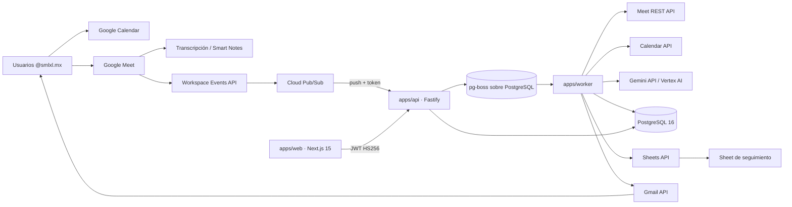

# SMLXL — Meeting Intelligence & Action Tracking Platform

Plataforma privada para `@smlxl.mx` que convierte las reuniones de Google Meet en compromisos organizados, trazables y accionables. Ingiere artefactos nativos de Meet (transcripción y Smart Notes), los analiza con IA para extraer resumen, decisiones y tareas, los reconcilia contra el backlog existente y mantiene el seguimiento semanal con aprobación humana obligatoria para cualquier cierre.

Especificación maestra: [`SMLXL_MASTER_PROMPT_PLATAFORMA_REUNIONES_IA_v1.0.md`](./SMLXL_MASTER_PROMPT_PLATAFORMA_REUNIONES_IA_v1.0.md) (fuente autoritativa; las secciones se citan como `§N`).

## Principios no negociables

| Principio                                                                                              | Referencia                        |
| ------------------------------------------------------------------------------------------------------ | --------------------------------- |
| PostgreSQL es la fuente maestra; el workbook legado es sólo fuente de migración y contrato funcional   | §16.1, ADR-003                    |
| La IA **propone**; una persona aprueba. `COMPLETED` sólo se alcanza aprobando una `CompletionProposal` | §5.1.10, §9.7.1, ADR-007, ADR-010 |
| Sin bot de reunión: captura vía Meet REST API + Workspace Events + Pub/Sub                             | §2.1, §12.1, ADR-002, ADR-004     |
| El dominio no conoce Google, Prisma, Gemini, HTTP ni EasyPanel                                         | §8.1                              |
| Toda automatización puede deshabilitarse (feature flags); todo funciona con adapters fake              | §45.13, §50, §51, ADR-011         |
| Toda mutación sensible se audita; toda tarea IA conserva evidencia                                     | §9.12, §45.10, §45.12             |
| RBAC siempre server-side                                                                               | §25                               |

## Arquitectura



Capas (§8): `Presentation (web/api) → Application (casos de uso) → Domain (entidades, reglas, puertos) → Infrastructure (adapters Google, Gemini, Prisma, pg-boss)`. Los adapters reales y los fake implementan los mismos puertos definidos en `@smlxl/domain`.

Documentación detallada: [`docs/architecture/overview.md`](./docs/architecture/overview.md), [`docs/architecture/data-flow.md`](./docs/architecture/data-flow.md).

## Estructura del monorepo

Sigue §38, con estas particularidades ya implementadas (ver ADR-012):

```text
smlxl-meeting-intelligence/
├── apps/
│   ├── web/            Next.js 15 (App Router), Auth.js v5, UI en español
│   ├── api/            Fastify + Zod + OpenAPI (/api/v1, /docs, /health, /metrics)
│   └── worker/         pg-boss: jobs de ingesta, IA, digest, notificaciones, sync
├── packages/
│   ├── domain/         enums, entities, ports, ai-types, errors, events, rules/*
│   ├── application/    casos de uso (§8.2) sobre los puertos del dominio
│   ├── contracts/      Zod: ai.ts (structured output), api.ts (DTOs), google.ts (Pub/Sub)
│   ├── config/         EnvSchema (§40), feature flags (§51), JobNames (§31)
│   ├── observability/  pino con redacción + registro de métricas (§33)
│   ├── database/       Prisma client (generado en src/generated), repositorios, prisma.config.ts
│   ├── google-workspace/ adapters Meet/Events/Calendar/Directory/Drive/Gmail/Sheets (fake + real) y scopes.ts
│   ├── ai/             GeminiAdapter + FakeAiAnalyzer, prompts versionados
│   ├── auth/           Auth.js v5, emisión/verificación JWT, dev bypass
│   └── ui/             componentes compartidos (shadcn/ui + Tailwind)
├── prisma/
│   ├── schema.prisma   esquema único (ADR-012)
│   ├── migrations/     migraciones versionadas
│   └── seed.ts         datos demo (§37)
├── scripts/legacy-import/  importador del workbook (§16.8)
├── docs/               architecture, adr, security, integrations, ux, api, runbooks
├── tests/              fixtures, integration (vitest + PostgreSQL), e2e (Playwright)
├── docker/             Dockerfiles multi-stage (api, worker, web)
├── .github/workflows/  CI (§41)
├── docker-compose.yml  postgres (dev) y perfil `full` (api+web+worker)
├── turbo.json · pnpm-workspace.yaml · tsconfig.base.json · eslint.config.mjs
└── .env.example        variables sin valores reales (§40)
```

## Prerrequisitos

- Node.js ≥ 20.11 (LTS)
- pnpm 9.12 (`corepack enable && corepack prepare pnpm@9.12.0 --activate`)
- Docker Desktop / Docker Engine con Compose v2
- Sin credenciales Google ni Gemini: el prototipo corre íntegramente con adapters fake

## Inicio rápido

```bash
cp .env.example .env               # valores por defecto listos para desarrollo
pnpm install
pnpm docker:up                     # PostgreSQL 16 en localhost:5460
pnpm db:generate                   # cliente Prisma → packages/database/src/generated
pnpm db:migrate                    # aplica prisma/migrations (prisma migrate dev)
pnpm db:seed                       # datos demo §37 (usuarios, 15 reuniones, 40 tareas…)
pnpm dev                           # web :3000 · api :4000 · worker
```

- Web: http://localhost:3000
- API: http://localhost:4000 — Swagger UI en http://localhost:4000/docs — OpenAPI en `/api/v1/openapi.json`
- Salud: http://localhost:4000/health · Métricas: http://localhost:4000/metrics

Con `AUTH_DEV_BYPASS=true` (solo `NODE_ENV=development`) la pantalla `/login` permite elegir un usuario seed por correo sin Google OAuth. La API acepta además el header `x-dev-user-email` para pruebas manuales.

## Recorrido de demostración (§50)

1. Abrir http://localhost:3000/login y entrar como `gestora@smlxl.mx` (rol con permisos de aprobación y digest).
2. **Inicio**: KPIs superiores, KPI por área y por persona, tendencia semanal, bloque _Necesitan atención_ y _Calidad de captura_ (§20).
3. **Reuniones** → abrir _"Seguimiento contrato Cliente Alfa"_: tab _Resumen_ con el resumen ejecutivo IA; tab _Compromisos_ con los tres compromisos extraídos.
4. En un compromiso, pulsar **Ver evidencia**: drawer con speaker, frase, timestamp y contexto anterior/posterior (§21).
5. **Revisión IA**: la tarjeta muestra que uno de los compromisos _coincide con pendiente existente_ (`ACT-…`, con porcentaje). Pulsar **Actualizar existente** → la tarea existente se vincula y actualiza; queda auditado.
6. **Pendientes**: cambiar el estado de una tarea (p. ej. _Pendiente → En progreso_) desde acciones rápidas. Marcar _Completar_ crea una **propuesta de cierre**; sólo un aprobador la convierte en _Completada_.
7. **Reportes** → **Generar digest semanal**: se muestra el resumen ejecutivo, nuevos compromisos, backlog, riesgos, cambios y bandeja de aprobación (§18.3).
8. **Vista previa de correo** del digest (HTML que enviaría Gmail; en modo fake no se envía nada).
9. **Integraciones** → **Sincronizar Sheets (dry-run)**: vista previa de las hojas `Pendientes` y `Reuniones` con UUID como clave (§16.9).
10. **Integraciones** → **Simular reunión terminada**: dispara el pipeline completo (`process-google-event → fetch-meeting-artifacts → analyze-meeting → reconcile-action-items`) con adapters fake y aparece una reunión nueva con propuestas en _Revisión IA_.

Todo lo anterior ocurre sin Google ni Gemini reales. Al activar flags y credenciales, los mismos casos de uso usan los adapters reales (ADR-011).

## Scripts (raíz)

| Script                                                         | Descripción                                                      |
| -------------------------------------------------------------- | ---------------------------------------------------------------- |
| `pnpm dev`                                                     | `turbo run dev --parallel`: web, api y worker en modo desarrollo |
| `pnpm build`                                                   | build de todos los paquetes/apps                                 |
| `pnpm lint` / `pnpm typecheck`                                 | ESLint (sin `any`) y `tsc --noEmit` por paquete                  |
| `pnpm test`                                                    | pruebas unitarias (vitest) por paquete                           |
| `pnpm test:integration`                                        | pruebas con PostgreSQL (`tests/integration/vitest.config.ts`)    |
| `pnpm test:e2e`                                                | Playwright (`tests/e2e/playwright.config.ts`)                    |
| `pnpm format` / `pnpm format:check`                            | Prettier                                                         |
| `pnpm db:generate`                                             | `prisma generate` (schema en `prisma/schema.prisma`)             |
| `pnpm db:migrate`                                              | `prisma migrate dev` (desarrollo)                                |
| `pnpm db:deploy`                                               | `prisma migrate deploy` (CI/producción)                          |
| `pnpm db:reset`                                                | reinicia la BD y reaplica migraciones (destructivo, sólo dev)    |
| `pnpm db:seed`                                                 | ejecuta `prisma/seed.ts`                                         |
| `pnpm db:studio`                                               | Prisma Studio                                                    |
| `pnpm legacy:import --file ./imports/<archivo>.xlsx --dry-run` | importador legado en modo reporte (§16.8)                        |
| `pnpm legacy:import --file ./imports/<archivo>.xlsx --commit`  | importador legado, escribe en BD                                 |
| `pnpm legacy:fixture`                                          | genera un workbook sintético anonimizado para pruebas            |
| `pnpm docker:up` / `pnpm docker:down`                          | PostgreSQL vía Docker Compose                                    |
| `pnpm clean`                                                   | limpia `dist`, `.turbo`, `node_modules`                          |

Detalle del importador: [`docs/runbooks/legacy-import.md`](./docs/runbooks/legacy-import.md).

## Feature flags (§51)

Los valores de `.env` son defaults; **Administración → Configuración** puede sobreescribirlos en BD (`PlatformSetting.featureFlags`).

| Flag                              | Default dev | Efecto                                                                                                                         |
| --------------------------------- | ----------- | ------------------------------------------------------------------------------------------------------------------------------ |
| `GOOGLE_INTEGRATION_ENABLED`      | `false`     | `false` → adapters fake de Meet/Calendar/Directory/Drive. `true` requiere credenciales DWD (`googleMode()` en `@smlxl/config`) |
| `GOOGLE_MEET_EVENTS_ENABLED`      | `false`     | crea/renueva suscripciones Workspace Events y acepta push Pub/Sub real                                                         |
| `AI_PROCESSING_ENABLED`           | `false`     | `false` → `FakeAiAnalyzer` determinístico; `true` → Gemini (`aiMode()`)                                                        |
| `AI_COMPLETION_PROPOSALS_ENABLED` | `true`      | permite que la IA genere `CompletionProposal` (nunca `COMPLETED`)                                                              |
| `GMAIL_NOTIFICATIONS_ENABLED`     | `false`     | envío real por Gmail; en `false` sólo se registra la vista previa                                                              |
| `SHEETS_SYNC_ENABLED`             | `false`     | escritura real en Google Sheets; en `false` sólo dry-run/preview                                                               |
| `WEEKLY_DIGEST_ENABLED`           | `true`      | programación y generación del digest semanal                                                                                   |

## Variables de entorno (§40)

Todas se validan en `packages/config` (`EnvSchema`). Nunca commitear `.env`.

| Variable                                                             | Uso                                                                   |
| -------------------------------------------------------------------- | --------------------------------------------------------------------- |
| `NODE_ENV`                                                           | `development` / `test` / `production`                                 |
| `APP_URL`, `API_URL`, `NEXT_PUBLIC_API_URL`                          | URLs públicas de web y API                                            |
| `PORT_API`, `PORT_WEB`                                               | puertos (4000 / 3000)                                                 |
| `LOG_LEVEL`                                                          | nivel pino                                                            |
| `COMPANY_TIMEZONE`                                                   | `America/Mexico_City` (§18.2)                                         |
| `DATABASE_URL`                                                       | PostgreSQL (dev: `localhost:5460`)                                    |
| `AUTH_SECRET`                                                        | firma de sesión Auth.js y del JWT web→API (obligatorio en producción) |
| `AUTH_DEV_BYPASS`                                                    | login por correo sin OAuth; rechazado en producción                   |
| `GOOGLE_OAUTH_CLIENT_ID`, `GOOGLE_OAUTH_CLIENT_SECRET`               | OAuth/OIDC de login (§6.5)                                            |
| `GOOGLE_WORKSPACE_DOMAIN`                                            | `smlxl.mx`; sólo usuarios de este dominio pueden entrar               |
| `GOOGLE_CLOUD_PROJECT_ID`                                            | proyecto GCP dedicado (§5.3.2)                                        |
| `GOOGLE_PUBSUB_TOPIC`, `GOOGLE_PUBSUB_SUBSCRIPTION`                  | topic/suscripción push para Workspace Events                          |
| `GOOGLE_PUBSUB_PUSH_TOKEN`                                           | token que debe traer el push en `?token=`                             |
| `GOOGLE_SERVICE_ACCOUNT_EMAIL`, `GOOGLE_SERVICE_ACCOUNT_CREDENTIALS` | service account con Domain-Wide Delegation (§13.4, §27)               |
| `GEMINI_API_KEY`, `GEMINI_MODEL`                                     | Gemini API (prototipo)                                                |
| `GOOGLE_GENAI_USE_VERTEXAI`, `GOOGLE_CLOUD_LOCATION`                 | Vertex AI en producción (§11)                                         |
| `GOOGLE_SHEETS_SPREADSHEET_ID`                                       | Sheet de proyección (§16.9)                                           |
| `GMAIL_SENDER_EMAIL`                                                 | buzón remitente (p. ej. `seguimiento@smlxl.mx`, pendiente P0-8)       |
| Flags `*_ENABLED`                                                    | ver tabla anterior                                                    |

## Pruebas (§36)

| Nivel       | Dónde                                      | Cómo                                                                                                                       |
| ----------- | ------------------------------------------ | -------------------------------------------------------------------------------------------------------------------------- |
| Unitarias   | `packages/*/src/**/*.test.ts`              | `pnpm test`. Cobertura alta en reconciliación, fechas, máquina de estados, RBAC, digest, idempotencia                      |
| Integración | `tests/integration/`                       | `pnpm test:integration` con PostgreSQL real; fixtures anonimizadas de Meet/Events/Gmail/Sheets/Gemini en `tests/fixtures/` |
| Contrato    | `packages/google-workspace`, `packages/ai` | respuestas de adapters validadas contra schemas Zod                                                                        |
| E2E         | `tests/e2e/specs/`                         | `pnpm test:e2e` (Playwright, chromium); 10 escenarios de §36                                                               |

## Despliegue (§6.6, §41)

- Imágenes: `docker/api.Dockerfile`, `docker/worker.Dockerfile`, `docker/web.Dockerfile` (multi-stage, usuario no root, healthcheck en API). Ver [`docker/README.md`](./docker/README.md).
- EasyPanel: un servicio por imagen + PostgreSQL gestionado; secretos en EasyPanel, nunca en Git. Migraciones con `pnpm db:deploy` antes de arrancar la API.
- Ramas: `main` (producción), `dev` (entorno dev), `feature/*`, `fix/*`. CI en `.github/workflows/ci.yml`; notas de despliegue en `.github/workflows/deploy.md`.
- Backups diarios de PostgreSQL a almacenamiento S3-compatible con prueba de restauración periódica (§42).

## Índice de documentación

| Área                  | Documentos                                                                                                                                                                                                                      |
| --------------------- | ------------------------------------------------------------------------------------------------------------------------------------------------------------------------------------------------------------------------------- |
| Arquitectura          | [overview](./docs/architecture/overview.md) · [data-flow](./docs/architecture/data-flow.md) · [google-workspace](./docs/architecture/google-workspace.md) · [ai-pipeline](./docs/architecture/ai-pipeline.md)                   |
| ADRs                  | [`docs/adr/`](./docs/adr/) ADR-001 … ADR-012                                                                                                                                                                                    |
| Seguridad             | [threat-model](./docs/security/threat-model.md) · [google-oauth-scopes](./docs/security/google-oauth-scopes.md)                                                                                                                 |
| Integraciones         | [google-meet](./docs/integrations/google-meet.md) · [google-events](./docs/integrations/google-events.md) · [google-sheets](./docs/integrations/google-sheets.md) · [gmail](./docs/integrations/gmail.md)                       |
| Runbooks              | [google-auth](./docs/runbooks/google-auth.md) · [reprocess-meeting](./docs/runbooks/reprocess-meeting.md) · [subscription-renewal](./docs/runbooks/subscription-renewal.md) · [legacy-import](./docs/runbooks/legacy-import.md) · [deploy-digitalocean](./docs/runbooks/deploy-digitalocean.md) |
| UX                    | [information-architecture](./docs/ux/information-architecture.md)                                                                                                                                                               |
| API                   | [README](./docs/api/README.md) · [endpoints](./docs/api/endpoints.md)                                                                                                                                                           |
| Fase 0                | [google-spike-results](./docs/google-spike-results.md) (PENDIENTE — requiere tenant real)                                                                                                                                       |
| Decisiones abiertas   | [decisions-log](./docs/decisions-log.md)                                                                                                                                                                                        |
| Guía para Claude Code | [CLAUDE.md](./CLAUDE.md)                                                                                                                                                                                                        |

## Estado y roadmap (§43)

| Fase                                   | Alcance                                                                                          | Estado en este prototipo                                                                                                                                                                   |
| -------------------------------------- | ------------------------------------------------------------------------------------------------ | ------------------------------------------------------------------------------------------------------------------------------------------------------------------------------------------ |
| **0 — Spike Google real**              | proyecto GCP, DWD, auto-artefactos, Events/Pub/Sub, host externo, renovación                     | **Pendiente**: requiere tenant SMLXL real y Super Admin. Runbook y plantilla de evidencia en `docs/google-spike-results.md`                                                                |
| **1 — Plataforma base + importador**   | monorepo, Auth, RBAC, catálogos, máquina de estados, importador dry-run, dashboard, auditoría    | Hecho: dominio, contratos, config, observabilidad, esquema Prisma + migración inicial, RBAC, máquina de estados, reglas de fechas. En curso: application, auth, web, api, importador, seed |
| **2 — Ingesta Calendar + Meet Events** | sync incremental, suscripciones por usuario, consumer Pub/Sub, ingesta de artefactos, safety-net | Diseñado y modelado (puertos, entidades, jobs). Adapters fake completos; adapters reales pendientes de validación en Fase 0                                                                |
| **3 — IA**                             | resumen, decisiones, tareas, reconciliación, propuestas de cierre, evidencia/confianza           | Structured output y confidence gate implementados en dominio/contratos; `FakeAiAnalyzer` para demo; `GeminiAdapter` pendiente de credenciales                                              |
| **4 — Workflow humano**                | Revisión IA, aprobar/rechazar, comentarios, historial, reapertura                                | Modelo y endpoints definidos; UI en construcción                                                                                                                                           |
| **5 — Digest + interoperabilidad**     | Gmail, `WeeklyDigestConfig`, Sheets, viernes/sábado                                              | Modelo, jobs y previews; envío/escritura reales tras flags + credenciales                                                                                                                  |
| **6 — Hardening**                      | E2E, seguridad, carga, backups, observabilidad, chaos                                            | E2E esqueleto (`test.fixme`), threat model, CI. Pendiente: pruebas de carga, chaos de eventos duplicados/perdidos                                                                          |

Bloqueantes para producción (no para el prototipo): las preguntas **P0** de §46.2 (alcance de "todas las reuniones", proyecto GCP/facturación, listado real de 10 cuentas, definición de "Vencido", destino del Sheet, historial a migrar, retención, cuenta remitente). Ver [`docs/decisions-log.md`](./docs/decisions-log.md).
