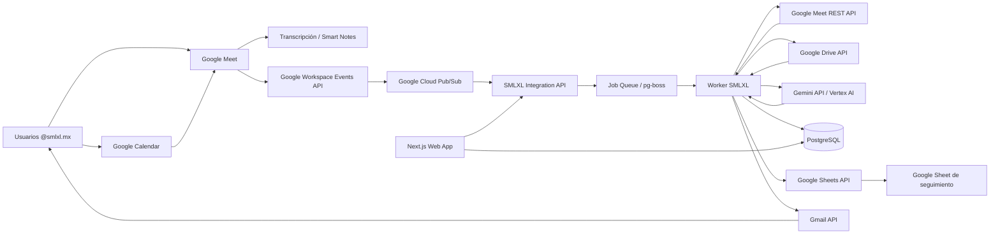
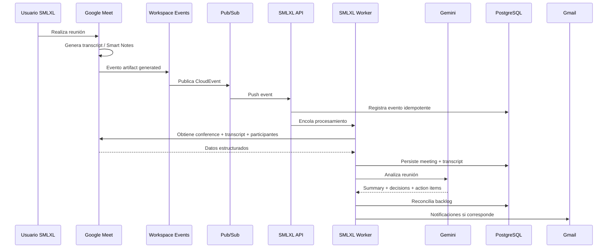

# SMLXL — Master Prompt / Especificación Funcional y Técnica
## Plataforma de Gestión de Reuniones y Seguimiento Automatizado mediante IA

**Organización:** SMLXL  
**Dominio corporativo:** `@smlxl.mx`  
**Tipo de solución:** Aplicación web interna / privada para la empresa  
**Canal principal de reuniones:** Google Meet / Google Calendar  
**Correo corporativo:** Gmail / Google Workspace  
**IA corporativa disponible:** Google Workspace Business Standard con Gemini en Workspace; “Toma notas por mí” y transcripción confirmadas visualmente en Google Meet  
**Documento:** v1.0 — Arquitectura validada, modelo legado analizado y especificación de desarrollo para Claude Code  
**Fecha de elaboración:** 2026-09-03  

## Estado de validación v1.0

Esta versión incorpora el discovery posterior al levantamiento inicial y debe considerarse la nueva fuente maestra de contexto del proyecto.

| Tema | Estado confirmado |
|---|---|
| Google Workspace | **Business Standard** |
| Dominio | `@smlxl.mx` |
| Cuentas actuales | **10** |
| Super Admin disponible | **Sí** |
| Gemini “Toma notas por mí” en Meet | **Sí, visible y utilizable** |
| Transcripción de Meet | **Sí, visible; puede iniciarse junto con las notas** |
| Idioma observado | **Español**; la UI actual lo presenta como Español (alfa) |
| Alcance funcional deseado | **Todas las reuniones de la empresa**, con la salvedad técnica de reuniones cuyo organizador sea externo descrita en este documento |
| Exclusiones actuales | **Ninguna**; se conserva capacidad de exclusión futura por gobierno/privacidad |
| Reporte semanal | **Dos destinatarios: gerente + gestora de la aplicación** |
| Programación del reporte | **Configurable**, inicialmente viernes o sábado |
| Cierre de tareas | **Nunca automático**: la IA propone y una persona aprueba/rechaza |
| Legado de seguimiento | Workbook `01_SMLXL_Maestro_de_Tareas_AGOSTO 2026.xlsx` analizado y tomado como base funcional para migración |

### Evidencia funcional observada en Google Meet

Las capturas suministradas confirman que la cuenta de SMLXL muestra:

- acceso a **“Notas para reuniones / Toma notas por mí”**;
- generación automática de resúmenes y elementos de acción;
- selector de idioma en español;
- opción **“Iniciar también la transcripción”**;
- inicio de notas desde la propia reunión.

Por lo tanto, el MVP **NO debe invertir tiempo en construir un bot participante de Meet**. Debe explotar primero los artefactos nativos de Google Meet y concentrar el desarrollo propio en reconciliación, trazabilidad, seguimiento y control.

---

# 0. INSTRUCCIÓN MAESTRA PARA CLAUDE CODE

Actúa simultáneamente como:

1. Arquitecto de software senior especializado en sistemas empresariales.
2. Arquitecto de integraciones Google Workspace / Google Cloud.
3. Ingeniero senior TypeScript / Node.js / Next.js.
4. Especialista en sistemas event-driven y automatización.
5. Especialista en IA generativa aplicada a extracción de acuerdos, tareas, compromisos y seguimiento.
6. Especialista UX/UI en aplicaciones empresariales B2B.
7. Especialista en seguridad, OAuth 2.0, Google Workspace Domain-Wide Delegation y principio de mínimo privilegio.
8. QA Lead responsable de pruebas unitarias, integración, E2E, seguridad y resiliencia.

Debes desarrollar la solución descrita en este documento sin simplificar silenciosamente los requerimientos.

Antes de implementar una decisión técnica que contradiga este documento:

- documenta la decisión en un ADR;
- explica el motivo;
- identifica impacto funcional, técnico y de seguridad;
- preserva compatibilidad con las interfaces de dominio definidas aquí.

No introducir dependencias innecesarias. Mantener una arquitectura modular, testeable y orientada a dominio.

---

# 1. CONTEXTO ORIGINAL DEL REQUERIMIENTO

La empresa SMLXL utiliza Google Workspace bajo el dominio corporativo `@smlxl.mx`.

El requerimiento nace de una operación con un volumen alto de reuniones diarias. Según la conversación inicial:

- una persona puede tener aproximadamente 5 reuniones diarias;
- otra persona puede tener aproximadamente otras 5;
- el equipo jurídico puede tener alrededor de 3;
- las reuniones no necesariamente coinciden entre los mismos participantes;
- el seguimiento actualmente depende de revisión humana posterior;
- los pendientes se acumulan semana a semana;
- se desea recibir un resumen consolidado de actividades nuevas y pendientes;
- se desea mantener y actualizar el backlog de compromisos;
- se desea automatizar la incorporación de información a una hoja de Google Sheets si resulta conveniente.

El usuario describe conceptualmente la necesidad como un “asistente virtual” que capture las reuniones de todo el equipo sin requerir que una persona específica, por ejemplo Luis o Andrés, tenga que estar presente en todas ellas.

## 1.1 Necesidad real identificada

La necesidad no es únicamente “grabar o resumir reuniones”.

La necesidad real es construir un **sistema corporativo de inteligencia y seguimiento de compromisos** que convierta reuniones dispersas en información accionable, trazable y medible.

El sistema debe responder preguntas como:

- ¿Qué reuniones ocurrieron esta semana?
- ¿Qué decisiones se tomaron?
- ¿Qué tareas nuevas surgieron?
- ¿Quién quedó responsable de cada actividad?
- ¿Qué fecha compromiso se mencionó?
- ¿Qué actividades siguen abiertas desde semanas anteriores?
- ¿Qué pendientes están vencidos?
- ¿Qué compromisos se repitieron en varias reuniones?
- ¿Qué compromisos cambiaron de fecha o responsable?
- ¿Qué tareas se cerraron?
- ¿Qué temas requieren seguimiento directivo?
- ¿Qué acciones nuevas aparecieron esta semana?
- ¿Qué reuniones generaron más pendientes?
- ¿Qué persona o área concentra mayor volumen de compromisos?

---

# 2. DECISIÓN ARQUITECTÓNICA PRINCIPAL

## 2.1 No construir inicialmente un bot que “entre” físicamente a las reuniones

La primera versión NO debe asumir que es necesario desarrollar un bot de audio/video que se conecte como participante visible a cada reunión.

Google Meet ofrece actualmente capacidades nativas para:

- transcripción automática;
- Smart Notes / “Take notes for me” mediante Gemini;
- recuperación posterior de transcripciones estructuradas;
- recuperación de Smart Notes;
- eventos de inicio/fin de conferencia;
- eventos de generación de transcripciones;
- eventos de generación de Smart Notes;
- recuperación de participantes y sesiones;
- configuración de generación automática de artefactos en Meeting Spaces.

Por lo tanto, la arquitectura recomendada debe ser **API-first y event-driven**.

### Flujo preferido

1. Un usuario `@smlxl.mx` crea u organiza una reunión de Google Meet.
2. La reunión está configurada para generar automáticamente transcripción y/o Smart Notes cuando las condiciones/licencias de Google lo permitan.
3. Google Meet genera los artefactos de reunión.
4. Google Workspace Events publica un evento.
5. Google Cloud Pub/Sub entrega el evento a la plataforma SMLXL.
6. La plataforma recupera la información estructurada mediante Google Meet REST API.
7. La plataforma almacena el material base.
8. El motor IA normaliza:
   - resumen;
   - decisiones;
   - tareas;
   - responsables;
   - fechas;
   - riesgos;
   - dependencias;
   - temas de seguimiento.
9. El sistema compara la información contra compromisos existentes.
10. Se crean, actualizan, vinculan o proponen cambios a tareas.
11. Los usuarios revisan excepciones o campos inciertos.
12. Los dashboards y reportes se actualizan.
13. En los momentos configurados se envían resúmenes y recordatorios.

## 2.2 Fallback

Si el plan actual de Google Workspace no soporta las capacidades necesarias, se deberá evaluar una de estas alternativas sin modificar el modelo de dominio:

- upgrade de Google Workspace;
- transcripción nativa de Meet + análisis IA propio;
- Smart Notes de Meet + análisis adicional propio;
- integración con proveedor externo de meeting intelligence;
- captura de audio mediante solución especializada, únicamente como último recurso.

La capa de dominio nunca debe depender directamente de un proveedor de transcripción.

---

# 3. OBJETIVOS DEL PRODUCTO

## 3.1 Objetivo general

Construir una plataforma privada para SMLXL que transforme automáticamente las reuniones corporativas en compromisos organizados, trazables y accionables, reduciendo al mínimo la carga manual de seguimiento.

## 3.2 Objetivos específicos

1. Detectar reuniones organizadas por usuarios del dominio.
2. Obtener información posterior a cada reunión.
3. Consolidar todas las reuniones relevantes en una única plataforma.
4. Generar un resumen ejecutivo automático.
5. Extraer decisiones y acuerdos.
6. Extraer tareas y compromisos.
7. Asignar responsable probable.
8. Detectar fecha compromiso cuando exista.
9. Mantener backlog histórico de tareas.
10. Detectar tareas duplicadas o relacionadas.
11. Permitir validación humana.
12. Automatizar recordatorios.
13. Elaborar resumen semanal.
14. Exportar/sincronizar información con Google Sheets.
15. Permitir búsqueda transversal de reuniones y acuerdos.
16. Crear una fuente única de verdad para seguimiento operativo.
17. Ofrecer visibilidad directiva del nivel de cumplimiento.

---

# 4. NO OBJETIVOS DEL MVP

El MVP no debe intentar convertirse en:

- reemplazo completo de Google Calendar;
- reemplazo completo de Google Meet;
- reemplazo de Gmail;
- ERP;
- CRM generalista;
- herramienta de gestión documental completa;
- sistema de recursos humanos;
- plataforma pública SaaS multiempresa.

El producto inicial es **single-tenant para SMLXL**.

La arquitectura debe permitir una evolución futura a multi-tenant, pero no introducir complejidad multiempresa prematuramente.

---

# 5. HECHOS CONFIRMADOS Y SUPUESTOS PENDIENTES

## 5.1 Hechos confirmados

1. SMLXL utiliza **Google Workspace Business Standard**.
2. Existen **10 cuentas corporativas** bajo `@smlxl.mx`.
3. Existe acceso de **Super Admin** disponible para configurar el tenant.
4. La función **“Toma notas por mí”** aparece en Google Meet para una cuenta de SMLXL.
5. La función de **transcripción** aparece y puede habilitarse desde la misma experiencia de notas.
6. El alcance deseado es procesar **todas las reuniones** de la empresa.
7. De momento **no existen reuniones excluidas** por categoría.
8. El resumen semanal tendrá inicialmente **dos destinatarios**: gerente y gestora de la aplicación.
9. El día/hora del digest debe ser **configurable**, con viernes/sábado como configuración inicial.
10. Una tarea **jamás debe cerrarse únicamente porque la IA infiera que terminó**. La IA creará una propuesta de cierre y una persona autorizada deberá aprobarla.
11. Existe un Maestro de Tareas real que deberá utilizarse como referencia de negocio y fuente de migración inicial.

## 5.2 Confirmación oficial de capacidades Google relevante al diseño

Al 2026-09-03, documentación oficial de Google confirma que:

- Google Meet Transcripts está incluido en **Business Standard**;
- “Take notes for me / Toma notas por mí” está disponible para **Business Standard**;
- Google Meet REST API expone `transcripts`, `transcripts.entries` y `smartNotes`;
- Smart Notes en Meet REST API y sus eventos `started`, `ended` y `fileGenerated` están en disponibilidad general desde abril de 2026;
- un `Space` permite configurar `autoTranscriptionGeneration` y `autoSmartNotesGeneration`;
- Google Workspace Events permite suscribirse a **un usuario de Meet**, recibiendo eventos de los espacios de reuniones de los que ese usuario es propietario;
- Domain-Wide Delegation permite que una service account actúe en nombre de usuarios del dominio para APIs de Meet que requieran autenticación de usuario;
- las entradas estructuradas de transcripción de Meet REST API se conservan aproximadamente **30 días**, por lo que deben ingerirse oportunamente.

## 5.3 Supuestos todavía pendientes de decisión

1. Si “todas las reuniones” incluye explícitamente reuniones **organizadas por terceros externos** en las que participa una cuenta `@smlxl.mx`. La arquitectura soportará cobertura *best effort* para ese caso, pero Google no ofrece una suscripción de Meet a “todas las reuniones donde el usuario participa”; la suscripción por usuario cubre las que el usuario **posee/organiza**.
2. Si se autoriza crear un **Google Cloud Project dedicado** para SMLXL, habilitar Pub/Sub/APIs y facturación.
3. Si el procesamiento IA propio usará **Vertex AI Gemini** o Gemini API; la licencia Workspace no debe asumirse como cuota de API backend.
4. Política de retención para transcript/smart notes y texto normalizado en PostgreSQL.
5. Si el Excel/Google Sheet actual continuará siendo editable por usuarios o se convertirá en una salida de compatibilidad.

---

# 6. STACK TECNOLÓGICO OBJETIVO

Mantener coherencia con el estándar técnico utilizado en otros proyectos del propietario.

## 6.1 Frontend

- Next.js 15+ con App Router
- React
- TypeScript strict
- Tailwind CSS
- shadcn/ui o componentes equivalentes basados en Radix
- TanStack Table para tablas complejas
- TanStack Query únicamente donde aporte valor frente a Server Components
- React Hook Form
- Zod
- Recharts para dashboards

## 6.2 Backend

Preferencia:

- Node.js LTS
- TypeScript strict
- Fastify
- Zod para contratos
- OpenAPI
- Prisma ORM
- PostgreSQL

El frontend Next.js NO debe contener toda la lógica de integración dentro de Route Handlers. Las integraciones, reglas de dominio y procesos de background deben residir en servicios claramente separados.

## 6.3 Worker

Crear worker independiente:

- Node.js + TypeScript
- reutiliza Application/Domain packages
- procesa eventos de Meet
- procesa IA
- genera digest
- envía notificaciones
- ejecuta sincronizaciones
- ejecuta reintentos

Para trabajos internos se recomienda inicialmente:

- `pg-boss` sobre PostgreSQL

Ventajas:

- evita agregar Redis en MVP;
- soporta jobs persistentes;
- reintentos;
- scheduling;
- procesamiento separado.

Si el volumen futuro lo requiere, la abstracción `JobQueuePort` permitirá migrar a BullMQ/Redis u otra infraestructura.

## 6.4 Persistencia

- PostgreSQL 16+
- Prisma ORM
- migraciones versionadas
- UUID
- `timestamptz`
- soft delete únicamente donde tenga sentido
- auditoría independiente, no basada en soft delete

## 6.5 Autenticación

- Auth.js
- Google OAuth/OIDC
- acceso permitido únicamente a usuarios `@smlxl.mx`
- opcionalmente allowlist adicional de usuarios
- sesiones seguras
- RBAC interno de la aplicación

## 6.6 Infraestructura

Aplicación:

- GitHub privado
- Docker
- EasyPanel
- HTTPS automático
- PostgreSQL gestionado por EasyPanel o servidor dedicado según infraestructura disponible
- backups externos S3-compatible

Google:

- Google Cloud Project específico
- Google Meet REST API
- Google Workspace Events API
- Google Cloud Pub/Sub
- Google Calendar API
- Google Drive API cuando sea requerido
- Google Sheets API
- Gmail API
- Admin SDK / People API solo si aportan información necesaria
- Gemini API o Vertex AI para procesamiento IA propio

---

# 7. ARQUITECTURA DE ALTO NIVEL



---

# 8. ARQUITECTURA LÓGICA

Implementar separación:

```text
Presentation
    ↓
Application
    ↓
Domain
    ↓
Infrastructure
```

## 8.1 Domain

No conoce:

- Google APIs;
- Prisma;
- Gemini;
- Gmail;
- Sheets;
- HTTP;
- EasyPanel.

Define:

- entidades;
- value objects;
- reglas;
- estados;
- puertos/interfaces;
- eventos de dominio.

## 8.2 Application

Implementa casos de uso:

- ProcessMeetingArtifact
- AnalyzeMeeting
- ExtractActionItems
- ReconcileActionItems
- ApproveActionItem
- UpdateActionItemStatus
- GenerateWeeklyDigest
- SendReminder
- SyncTasksToGoogleSheets
- ReprocessMeeting
- SearchMeetingKnowledge

## 8.3 Infrastructure

Adapters:

- GoogleMeetAdapter
- GoogleWorkspaceEventsAdapter
- GoogleCalendarAdapter
- GoogleDriveAdapter
- GoogleSheetsAdapter
- GmailAdapter
- GeminiAdapter
- Prisma repositories
- PgBossJobQueue

---

# 9. MODELO FUNCIONAL PRINCIPAL

## 9.1 Meeting

Representa una reunión corporativa.

Campos mínimos:

- id
- googleConferenceRecordId
- googleMeetingSpaceId
- googleMeetingCode
- googleCalendarEventId
- title
- organizerUserId
- startAt
- endAt
- durationSeconds
- status
- source
- processingStatus
- transcriptStatus
- smartNotesStatus
- aiAnalysisStatus
- confidentialityLevel
- createdAt
- updatedAt

## 9.2 MeetingParticipant

- id
- meetingId
- internalUserId nullable
- googleParticipantId
- displayName
- email nullable
- participantType
- isInternal
- joinedAt
- leftAt
- speakingDuration nullable

## 9.3 Transcript

- id
- meetingId
- sourceType
- googleTranscriptId
- languageCode
- startedAt
- endedAt
- rawText
- structuredPayload JSONB opcional
- sourceUri
- retainedUntil nullable
- ingestionChecksum

## 9.4 TranscriptSegment

Útil para citas y trazabilidad.

- id
- transcriptId
- participantId nullable
- speakerLabel
- text
- startAt
- endAt
- sequence

## 9.5 MeetingSummary

- id
- meetingId
- executiveSummary
- detailedSummary
- topics JSONB
- risks JSONB
- openQuestions JSONB
- aiModel
- promptVersion
- generatedAt
- approvedAt nullable

## 9.6 Decision

- id
- meetingId
- description
- decidedBy nullable
- effectiveDate nullable
- confidence
- sourceSegmentIds
- status

## 9.7 ActionItem

Entidad central del sistema.

Campos:

- id
- externalKey
- title
- description
- ownerUserId nullable
- ownerTextOriginal nullable
- areaId nullable
- createdFromMeetingId
- latestMeetingId
- status
- priority
- dueDate nullable
- startDate nullable
- completedAt nullable
- confidence
- requiresReview
- sourceEvidence JSONB
- recurrence nullable
- blocker nullable
- tags
- createdAt
- updatedAt

Estados iniciales:

```text
PROPOSED
OPEN
IN_PROGRESS
BLOCKED
WAITING
DONE
CANCELLED
```

## 9.7.1 CompletionProposal

Representa la inferencia de que una tarea podría estar terminada.

Campos:

- id
- actionItemId
- proposedByType: AI | USER
- proposedByUserId nullable
- proposedFromMeetingId nullable
- reason
- evidenceSegmentIds[]
- confidence
- status: PENDING | APPROVED | REJECTED | EXPIRED
- reviewedByUserId nullable
- reviewedAt nullable
- reviewComment nullable
- createdAt

Regla inmutable:

> Una `CompletionProposal` aprobada es la única ruta IA hacia `ActionItem.status=COMPLETED`. La IA no modifica directamente el estado a completado.

## 9.7.2 ExternalAssignee

Para tareas del sheet `Externos` o terceros mencionados en reuniones.

Campos:

- id
- displayName
- company
- email nullable
- phone nullable
- source
- active

No crear cuentas de acceso automáticamente para terceros.

## 9.7.3 Project y ProjectAlias

El workbook contiene variantes de nombres de proyectos. Crear catálogo canónico y aliases para reconciliación IA/migración.

`Project`:

- id
- canonicalName
- code nullable
- active
- areaId nullable

`ProjectAlias`:

- id
- projectId
- aliasNormalized UNIQUE
- source

## 9.7.4 LegacyImportReference

- id
- entityType
- entityId
- sourceFile
- sourceSheet
- sourceRow
- legacyId
- rawPayload jsonb
- importBatchId
- importedAt

`legacyId` no debe tener restricción UNIQUE global.

## 9.8 ActionItemMeetingLink

Una tarea puede aparecer en múltiples reuniones.

- id
- actionItemId
- meetingId
- relationType
- evidence
- previousStatus nullable
- detectedStatus nullable
- detectedDueDate nullable

RelationType:

```text
CREATED
MENTIONED
UPDATED
BLOCKED
COMPLETED
REOPENED
```

## 9.9 User

- id
- googleUserId
- email
- displayName
- role
- areaId
- active
- managerId nullable
- notificationPreferences JSONB

## 9.10 Area

Ejemplos:

- Dirección
- Jurídico
- Operaciones
- Administración
- Comercial

No hardcodear áreas. Deben ser configurables.

## 9.11 WeeklyDigest

- id
- weekStart
- weekEnd
- generatedAt
- audience
- payload JSONB
- sentAt nullable
- version

## 9.12 AuditLog

Registrar:

- actor
- action
- entity
- entityId
- before
- after
- source
- timestamp
- correlationId

---

# 10. MOTOR DE IA

## 10.1 Principio

La IA propone; las reglas determinísticas y los usuarios validan cuando exista ambigüedad relevante.

No permitir que un LLM modifique de manera irreversible estados críticos sin trazabilidad.

## 10.2 Pipeline IA

### Paso 1 — Normalización

Entrada:

- metadata de reunión;
- transcript segments;
- Smart Notes si existen;
- participantes;
- contexto de acciones abiertas relacionadas.

Salida:

- texto normalizado;
- speakers normalizados;
- entidades candidatas.

### Paso 2 — Clasificación de temas

Extraer:

- temas principales;
- subtemas;
- proyecto/cliente/asunto probable;
- sensibilidad.

### Paso 3 — Resumen

Generar:

- resumen ejecutivo de 3–7 bullets;
- resumen detallado;
- puntos que requieren atención.

### Paso 4 — Decisiones

Extraer solamente decisiones explícitas o altamente probables.

Cada decisión debe incluir:

- descripción;
- evidencia textual;
- speaker/participante si es identificable;
- timestamp;
- confidence.

### Paso 5 — Action Items

Salida estrictamente tipada:

```ts
type ExtractedActionItem = {
  title: string
  description?: string
  owner: {
    name?: string
    email?: string
    evidence: string
  } | null
  dueDate: string | null
  dueDateTextOriginal?: string
  priority: 'LOW' | 'MEDIUM' | 'HIGH' | 'URGENT' | null
  statusHint: 'NEW' | 'UPDATE' | 'DONE' | 'BLOCKED' | 'UNKNOWN'
  evidence: Array<{
    text: string
    speaker?: string
    startTime?: string
    endTime?: string
  }>
  confidence: number
}
```

### Paso 6 — Reconciliación contra backlog

Antes de crear una tarea nueva:

1. Buscar tareas abiertas del mismo responsable/área.
2. Buscar similitud semántica.
3. Comparar referencias a cliente/proyecto/asunto.
4. Comparar descripción.
5. Revisar historial de reuniones relacionadas.

Resultado:

```text
CREATE_NEW
LINK_EXISTING
UPDATE_EXISTING
MARK_DONE_CANDIDATE
REOPEN_CANDIDATE
REQUIRES_HUMAN_REVIEW
```

No usar únicamente embeddings para decidir duplicados.

Combinar:

- reglas;
- búsqueda full-text;
- similitud semántica;
- LLM judge con contexto limitado.

### Paso 7 — Confidence Gate

Ejemplo inicial:

- `>= 0.90`: autoaceptar campos no críticos.
- `0.70–0.89`: crear como propuesta y mostrar indicador.
- `< 0.70`: enviar a bandeja de revisión.

Los umbrales deben ser configurables.

## 10.3 Structured Output obligatorio

Todo resultado de IA que modifique datos debe utilizar JSON Schema/Zod.

Nunca parsear texto libre con regex para crear compromisos.

## 10.4 Prompt Versioning

Guardar:

- promptVersion
- model
- temperature
- schemaVersion
- processingRunId

Permitir reprocesar una reunión con una versión nueva sin perder el análisis anterior.

---

# 11. GEMINI / MODELO IA

Crear interfaz:

```ts
interface AiMeetingAnalyzer {
  analyzeMeeting(input: AnalyzeMeetingInput): Promise<MeetingAnalysisResult>
  reconcileActionItems(input: ReconcileInput): Promise<ReconcileResult>
  generateWeeklyDigest(input: WeeklyDigestInput): Promise<WeeklyDigestResult>
}
```

Implementación inicial:

- Gemini mediante Google Gen AI SDK;
- preferentemente Vertex AI en producción empresarial si se requiere mayor gobierno IAM/Cloud;
- permitir Gemini API como opción para prototipo.

IMPORTANTE:

La licencia de Gemini incluida en Google Workspace sirve para las funcionalidades de Workspace disponibles para los usuarios, pero el backend de una aplicación propia debe tratar el acceso a Gemini API/Vertex AI como un servicio de API independiente con proyecto, cuotas y facturación correspondientes.

Nunca introducir API keys en frontend.

---

# 12. INTEGRACIÓN GOOGLE MEET

## 12.1 Decisión v1.0

La captura principal se realizará mediante **artefactos nativos de Google Meet**, no mediante un bot que se una como participante.

La evidencia del tenant confirma que SMLXL puede iniciar “Toma notas por mí” y, desde la misma experiencia, activar también la transcripción. Google documenta Business Standard como edición compatible con transcripción y funciones Gemini en Meet.

## 12.2 Capacidades requeridas

Google Meet REST API deberá utilizarse para:

- resolver `Space` por ID o `meetingCode`;
- consultar `ConferenceRecord`;
- participantes y `participantSessions`;
- transcripts;
- transcript entries estructurados por participante;
- Smart Notes;
- configuración de artefactos del `Space`;
- recuperación de metadata post-reunión.

Persistir siempre los identificadores canónicos de Google (`space.name`, `conferenceRecord.name`, transcript/smartNote resource names). No utilizar el `meetingCode` como clave histórica permanente.

## 12.3 Auto-generación de artefactos

Para reuniones organizadas por usuarios internos y cuando el usuario/política lo permita, el objetivo del spike técnico es probar:

```text
config.artifactConfig.transcriptionConfig.autoTranscriptionGeneration = ON
config.artifactConfig.smartNotesConfig.autoSmartNotesGeneration = ON
```

No activar grabación de video automáticamente.

### Regla de aplicación

```text
Calendar event con Meet creado/actualizado
  -> extraer meetingCode
  -> Meet spaces.get(spaces/{meetingCode})
  -> obtener space.name canónico
  -> si organizador @smlxl.mx y política AUTO_CAPTURE=true
       -> spaces.patch artifactConfig
  -> persistir capability result
```

El `spaces.patch` debe ejecutarse impersonando al propietario cuando sea necesario. Si Google rechaza el cambio por privilegios/política, registrar `CAPABILITY_BLOCKED` y continuar sin romper la reunión.

## 12.4 Reuniones con organizador externo

Este caso debe tratarse de forma distinta.

Un usuario de SMLXL puede ser participante de una reunión cuyo `Space` pertenece a otra organización. En ese escenario:

- SMLXL no debe asumir que puede modificar `artifactConfig`;
- no puede garantizar que se generen Smart Notes/transcripción;
- si existe una transcripción/ConferenceRecord accesible al participante interno, se intentará recuperar mediante impersonación del usuario que participó;
- si no existe artefacto o acceso, la reunión se marca como `UNAVAILABLE_EXTERNAL_HOST` y no se inventa contenido.

Esta limitación debe ser visible en UX y en el digest de calidad de captura.

## 12.5 Idioma

Las reuniones se asumirán principalmente en español. La UI observada muestra Español (alfa).

La plataforma debe registrar:

- idioma reportado por Google;
- idioma detectado por el modelo;
- bandera `mixedLanguageDetected`;
- calidad/confianza de extracción.

No asumir que “Toma notas por mí” procesa correctamente reuniones multilingües simultáneas; actualmente Google documenta soporte de un idioma a la vez.

---

# 13. GOOGLE WORKSPACE EVENTS + PUB/SUB

## 13.1 Eventos prioritarios

Suscribirse a:

```text
google.workspace.meet.conference.v2.started
google.workspace.meet.conference.v2.ended
google.workspace.meet.transcript.v2.started
google.workspace.meet.transcript.v2.ended
google.workspace.meet.transcript.v2.fileGenerated
google.workspace.meet.smartNote.v2.started
google.workspace.meet.smartNote.v2.ended
google.workspace.meet.smartNote.v2.fileGenerated
```

Los eventos de participante son opcionales para el MVP.

## 13.2 Estrategia confirmada para las 10 cuentas

El tenant tiene 10 cuentas. Para cubrir reuniones **propiedad/organizadas** por cualquiera de ellas:

```text
por cada usuario activo @smlxl.mx
  -> resolver Cloud Identity / Directory user ID
  -> crear una Google Workspace Events subscription target=user
  -> eventTypes = conferencia + transcript + smartNote
  -> notificationEndpoint = Pub/Sub
  -> persistir subscription
```

No existe una única suscripción Meet de tipo “customer/domain” documentada para todos los usuarios. Por lo tanto, el diseño correcto es mantener una suscripción por usuario monitoreado.

### Payload elegido

Preferir eventos **sin resource data embebido** y recuperar el recurso después con Meet REST API.

Motivos:

- reduce exposición de datos en Pub/Sub;
- maximiza TTL de la suscripción (hasta 7 días según documentación actual);
- simplifica eventos e idempotencia;
- Meet REST API será la fuente estructurada de detalle.

Crear job de renovación al menos diario y renovar cuando `expiresAt - now < 48h`.

## 13.3 Cobertura adicional para reuniones con host externo

Como una suscripción de usuario recibe eventos de los espacios **que posee ese usuario**, no garantiza eventos de una reunión organizada externamente donde un usuario SMLXL solo participa.

Implementar un segundo mecanismo:

```text
Calendar Incremental Sync (10 usuarios)
  -> detectar eventos con Meet URI
  -> registrar meetingCode + asistentes internos
  -> después de la ventana estimada de reunión
       -> si no llegó conference event
       -> conferenceRecords.list(filter space.meeting_code=...)
          impersonando a un asistente interno
       -> si ConferenceRecord accesible, ingerir artefactos
       -> si no, marcar best-effort unavailable
```

Esta capa también sirve como **safety net** ante pérdida temporal de eventos.

## 13.4 Domain-Wide Delegation

Crear una service account dedicada y autorizar únicamente scopes aprobados. La service account debe impersonar al usuario correspondiente; no debe existir una “cuenta omnipotente” usada indiscriminadamente.

El set definitivo de scopes se cerrará durante el spike, pero las categorías necesarias son:

- Meet metadata/settings;
- Calendar read;
- Directory/Identity read para resolver usuarios;
- Drive/Docs read solo cuando un artefacto requiera recuperar contenido;
- Gmail send para el buzón remitente de reportes.

## 13.5 Idempotencia

Cada evento debe tener clave idempotente. Persistir `InboundGoogleEvent` con `cloudEventId` único.

Nunca procesar dos veces el mismo `conferenceRecord + artifactResource + artifactState` como operación nueva.

Entidad `GoogleWorkspaceSubscription`:

- id
- monitoredUserId
- monitoredUserEmail
- googleSubscriptionName
- targetResource
- eventTypes[]
- expiresAt
- state
- lastRenewedAt
- lastErrorCode
- lastErrorAt

Entidad `InboundGoogleEvent`:

- cloudEventId UNIQUE
- type
- source
- subject
- occurredAt
- resourceName
- rawPayloadEncryptedOrRedacted
- receivedAt
- processedAt
- processingStatus
- attempts

---

# 14. GOOGLE CALENDAR

Google Calendar no será la fuente maestra de tareas, pero sí la fuente de **inventario preventivo de reuniones**.

## 14.1 Objetivos

Recuperar por cada una de las 10 cuentas:

- título;
- organizador;
- creador;
- invitados;
- fecha/hora/timezone;
- recurrencia;
- descripción;
- `hangoutLink` / Meet URI;
- Calendar Event ID;
- estado/cancelación;
- attendee response status cuando sea útil.

## 14.2 Estrategia de sincronización

Implementar incremental sync por usuario con `syncToken` persistente.

No realizar full scan de todos los calendarios en cada ciclo.

Entidad `CalendarSyncCursor`:

- userId
- calendarId
- syncToken
- lastFullSyncAt
- lastIncrementalSyncAt
- lastError

## 14.3 Papel en cobertura total

Calendar resolverá dos problemas:

1. conocer reuniones futuras para intentar habilitar auto-artifacts en reuniones internas;
2. detectar reuniones organizadas externamente que no producen una Workspace Events user subscription interna.

`Meeting.source` debe permitir:

- `WORKSPACE_EVENT`
- `CALENDAR_DISCOVERY`
- `MANUAL_IMPORT`
- `LEGACY_IMPORT`

El Calendar Event NO será la fuente maestra de compromisos.

---

# 15. GOOGLE DRIVE

Utilizar únicamente cuando resulte necesario para:

- documentos Smart Notes;
- archivos de transcripción;
- links originales;
- exportación específica.

Siempre que la Meet REST API entregue datos estructurados suficientes, preferir Meet API sobre parsing de Google Docs.

Nota de retención:

Los `transcript entries` de Meet API pueden tener una ventana de retención inferior a la del artefacto persistido en Drive; por ello la plataforma debe ingerir y persistir oportunamente la información necesaria según la política corporativa aprobada.

---

# 16. GOOGLE SHEETS / EXCEL LEGADO Y MIGRACIÓN

## 16.1 Decisión

PostgreSQL será la fuente maestra. El workbook actual es **fuente de migración y contrato funcional**, no la base de datos futura.

Archivo analizado:

`01_SMLXL_Maestro_de_Tareas_AGOSTO 2026.xlsx`

## 16.2 Estructura observada

El workbook contiene:

- `Dashboard`
- `Maestro`
- `Jurídico`
- `Ventas y Marketing`
- `Operaciones y Proyectos`
- `Admin y Finanzas`
- `Dirección General`
- `Captación de Capital`
- `Servicio al Cliente`
- `Externos`
- `Listas`

Columnas principales del seguimiento interno:

| Legado | Significado | Modelo nuevo |
|---|---|---|
| ID | identificador manual | `legacyId`; **no** PK |
| Pendiente | acción/tarea | `ActionItem.title` |
| Responsable | dueño | `assigneeUserId` o `externalAssigneeId` |
| Departamento | área | `areaId` |
| Proyecto / Frente | proyecto/frente | `projectId` |
| Fecha de la junta | reunión origen | `sourceMeeting.startedAt` |
| Semana | semana ISO | derivada; no editable |
| Prioridad | Alta/Media/Baja | enum canonical |
| Status | estado | enum canonical |
| Completada | flag 0/1 | **eliminar**, es redundante |
| Vencido? | Sí/No manual | **derivar de dueDate**, no persistir como verdad manual |
| Comentarios | seguimiento | `ActionItemComment` / status history |

El sheet `Externos` tiene una estructura ligeramente distinta y debe migrarse a `ExternalAssignee`, no forzarse a un usuario Google.

## 16.3 Baseline operativo observado

El `Dashboard` legado muestra, en sus valores calculados actuales:

- 166 tareas internas;
- 99 marcadas como completadas por el flag numérico;
- 31 “En proceso”;
- 41 “Pendiente”;
- 19 vencidas según el KPI del dashboard;
- avance aproximado 59.6%.

El sheet `Externos` contiene 7 tareas adicionales, por lo que el análisis de hojas fuente observa **173 filas de tareas** en total (166 internas + 7 externas).

Estos números son baseline para validar el importador, **no deben asumirse como datos limpios**.

## 16.4 Problemas de calidad detectados que el sistema nuevo debe resolver

1. `ID` no es globalmente único. Existen IDs repetidos incluso dentro de áreas diferentes y algunos dentro de una misma hoja.
2. Estado y flag `Completada` pueden contradecirse. Se detectaron filas con `Status=Pendiente/En proceso` y `Completada=1`.
3. Existen variantes de casing/ortografía: `Completo`/`completo`, `Andrés`/`Andres`, `Lisa de la Fuente`/`Lisa de La Fuente`, `Escandón`/`Escandon`.
4. Hay valores vacíos/0 que llegan a columnas de negocio.
5. `Vencido?` está capturado como dato, pero el archivo no contiene una columna canónica de `Fecha compromiso`; en el nuevo sistema vencimiento debe derivarse de fecha compromiso real.
6. Comentarios contienen evidencia de estados ambiguos: por ejemplo textos equivalentes a “falta…”, “por revisar” o “proyecto en pausa” en tareas marcadas como completas.
7. Algunos pendientes son **actividades recurrentes** (“diaria”, “semanal”) y no deberían cerrarse como una tarea de una sola ejecución.
8. Hay proyectos/frentes conceptualmente equivalentes con variantes de nombre.

## 16.5 Modelo canónico de estados

No replicar el doble control `Status + Completada`.

Usar:

```text
PENDING
IN_PROGRESS
BLOCKED
COMPLETION_PROPOSED
COMPLETED
CANCELLED
```

Reglas:

```text
PENDING -> IN_PROGRESS
PENDING/IN_PROGRESS/BLOCKED -> COMPLETION_PROPOSED   // IA o usuario propone
COMPLETION_PROPOSED -> COMPLETED                    // aprobación humana
COMPLETION_PROPOSED -> PENDING/IN_PROGRESS          // rechazo humano
COMPLETED -> IN_PROGRESS                            // reapertura auditada
ANY_OPEN -> CANCELLED                               // humano autorizado
```

`COMPLETION_PROPOSED` es esencial debido al requisito confirmado de aprobación humana.

Mapeo inicial del legado:

- `Pendiente` -> `PENDING`
- `En proceso` -> `IN_PROGRESS`
- `Completo`/`completo` -> `COMPLETED` **solo como dato migrado**, marcando `migrationTrust=LEGACY`; no se debe asumir que pasó por flujo de aprobación
- `Entregado` -> `COMPLETION_PROPOSED` durante migración, salvo regla de negocio posterior

## 16.6 Vencimientos

Agregar `dueDate` como campo de primera clase.

```text
isOverdue = dueDate != null
            AND now > endOfDay(dueDate, companyTimezone)
            AND status NOT IN (COMPLETED, CANCELLED)
```

Nunca permitir edición manual de `isOverdue`.

Cuando una reunión no mencione fecha:

- `dueDate = null`;
- `dateConfidence = null/LOW`;
- mostrar `SIN FECHA`;
- permitir que humano asigne fecha.

## 16.7 Actividades recurrentes

Introducir:

- `ActionItemType = ONE_OFF | RECURRING`
- `RecurrenceRule` opcional
- `parentActionItemId` para instancias generadas

Una actividad “dar seguimiento día a día” no debe quedar “completa para siempre” por cerrar una ejecución.

## 16.8 Importador legado

Crear comando idempotente:

```bash
pnpm legacy:import --file ./imports/01_SMLXL_Maestro_de_Tareas_AGOSTO_2026.xlsx --dry-run
pnpm legacy:import --file ./imports/01_SMLXL_Maestro_de_Tareas_AGOSTO_2026.xlsx --commit
```

Fases:

1. leer hojas fuente, no el `Maestro` calculado;
2. normalizar textos;
3. crear aliases de persona/proyecto;
4. generar UUID nuevo por fila;
5. conservar `legacySheet`, `legacyRow`, `legacyId`;
6. detectar posibles duplicados semánticos, pero **no fusionarlos automáticamente**;
7. emitir reporte de excepciones;
8. importar historial como `LEGACY_IMPORT`;
9. comparar KPIs contra baseline.

## 16.9 Google Sheets posterior al go-live

Si el negocio desea conservar un Sheet:

- será una proyección/exportación;
- debe incluir `ActionItem.id`;
- no depender de fila;
- la sincronización bidireccional solo se implementará si se confirma que usuarios seguirán editando directamente el Sheet.

Hoja sugerida `Pendientes`:

| UUID | Legacy ID | Estado | Prioridad | Actividad | Responsable | Área | Proyecto | Fecha compromiso | Reunión origen | Última mención | Días abierto | Vencido |
|---|---|---|---|---|---|---|---|---|---|---|---:|---|

Hoja sugerida `Reuniones`:

| Fecha | Reunión | Organizador | Participantes | Resumen | # Acuerdos | # Tareas nuevas | Link plataforma |
|---|---|---|---|---|---:|---:|---|

---

# 17. GMAIL Y NOTIFICACIONES

La empresa utiliza Gmail.

Crear canal de correo corporativo mediante Gmail API.

Idealmente utilizar una cuenta funcional, por ejemplo:

```text
seguimiento@smlxl.mx
```

Nombre definitivo pendiente.

Tipos de correo:

1. Resumen post-reunión opcional.
2. Tareas nuevas asignadas.
3. Recordatorio previo a vencimiento.
4. Tarea vencida.
5. Digest semanal individual.
6. Digest semanal directivo.
7. Resumen de pendientes por área.
8. Errores operativos únicamente para administradores.

No generar spam.

Permitir preferencias por usuario.

---

# 18. RESUMEN SEMANAL

Esta función es obligatoria y ya tiene configuración de negocio inicial confirmada.

## 18.1 Destinatarios

Inicialmente:

- gerente;
- gestora de la aplicación.

No hardcodear direcciones. Configurar por `WeeklyDigestConfig.recipients`.

## 18.2 Programación

El envío debe ser configurable desde administración.

Configuración inicial aceptada:

- día: viernes **o** sábado;
- hora: configurable;
- timezone: `America/Mexico_City` salvo confirmación distinta;
- una sola versión del reporte para ambos destinatarios en MVP.

Entidad:

`WeeklyDigestConfig`

- id
- enabled
- timezone
- dayOfWeek
- localTime
- recipientUserIds[]
- includeAreas[] nullable
- includeExternalTasks boolean
- attachSpreadsheet boolean
- sendEmail boolean
- createdBy
- updatedBy

## 18.3 Contenido del digest directivo

### A. Resumen ejecutivo

- reuniones detectadas;
- reuniones procesadas correctamente;
- reuniones sin artefactos;
- reuniones con error;
- tareas nuevas;
- propuestas de cierre pendientes de aprobación;
- tareas aprobadas como completadas;
- tareas vencidas;
- tareas sin fecha;
- tareas bloqueadas.

### B. Nuevos compromisos de la semana

Agrupar por responsable, área y prioridad.

### C. Backlog acumulado

- abiertos anteriores;
- antigüedad;
- última mención;
- última evidencia de avance.

### D. Riesgos

- vencidos;
- sin responsable;
- sin fecha;
- bloqueados;
- repetidos varias reuniones;
- reuniones no capturadas por host externo/artefactos ausentes.

### E. Cambios detectados

- fecha propuesta o modificada;
- responsable cambiado;
- prioridad cambiada;
- posible finalización detectada;
- tarea reabierta;
- tarea posiblemente duplicada.

### F. Bandeja de aprobación

El digest debe incluir enlaces directos a las tareas con `COMPLETION_PROPOSED`.

No cambiar a `COMPLETED` desde el job del digest.

### G. Próxima semana

- vencimientos próximos;
- temas recurrentes;
- acciones de alta prioridad;
- actividades recurrentes programadas.

---

# 19. UX/UI — PRINCIPIOS

La plataforma debe transmitir:

- claridad;
- control;
- trazabilidad;
- mínima carga administrativa.

No construir una interfaz que parezca un simple spreadsheet.

El usuario debe poder entender en menos de 30 segundos:

1. qué pasó;
2. qué es nuevo;
3. qué está atrasado;
4. qué necesita su intervención.

## 19.1 Layout

Sidebar:

```text
Inicio
Reuniones
Pendientes
Revisión IA
Reportes
Equipo
Integraciones
Configuración
Administración
```

Header:

- buscador global;
- selector de periodo;
- notificaciones;
- perfil.

---

# 20. PANTALLA — DASHBOARD

La UX debe conservar familiaridad con el Dashboard actual del Maestro de Tareas, pero corregir sus limitaciones de datos.

## 20.1 KPIs superiores

- Total abiertos
- Completadas en período
- En proceso
- Pendientes
- Propuestas de cierre
- % avance
- Vencidas
- Sin fecha
- Reuniones procesadas / reuniones detectadas

## 20.2 KPI por Departamento

Mantener una vista equivalente a la hoja actual:

- Total
- Completadas
- En proceso
- Pendientes
- Propuestas de cierre
- Vencidas
- % avance

Áreas iniciales observadas en el legado:

- Dirección General
- Admin y Finanzas
- Ventas y Marketing
- Jurídico
- Operaciones y Proyectos
- Captación de Capital
- Servicio al Cliente
- Externos como categoría especial, no departamento interno

No hardcodear estas áreas en UI; deben provenir de catálogo.

## 20.3 KPI por Persona

Conservar el patrón del workbook actual:

- Total
- Completadas
- En proceso
- Pendientes
- Vencidas
- % avance

Agregar filtros por área/proyecto/período.

## 20.4 Tendencia semanal

Visualizar:

- nuevas;
- completadas aprobadas;
- pendientes fin de semana;
- vencidas;
- tasa de cierre.

La semana se calcula desde fechas, nunca se escribe manualmente.

## 20.5 “Necesitan atención”

Ordenar por un score explicable:

1. vencida + prioridad alta;
2. propuesta de cierre esperando aprobación;
3. sin responsable;
4. sin fecha;
5. repetida sin avance;
6. bloqueada;
7. baja confianza IA.

## 20.6 “Calidad de captura”

Nuevo bloque obligatorio:

- reuniones detectadas;
- con transcript;
- con Smart Notes;
- procesadas solo con transcript;
- sin artefacto;
- host externo/no accesible;
- errores de API.

Esto evita que dirección asuma que “todas las reuniones” significa que Google produjo artefactos para el 100% de ellas.

---

# 21. PANTALLA — REUNIONES

Tabla:

- fecha;
- título;
- organizador;
- participantes;
- duración;
- status transcript;
- status IA;
- acciones extraídas;
- nivel de confianza;
- estado revisión.

Filtros:

- rango fechas;
- organizador;
- área;
- participante;
- procesada/no procesada;
- con tareas;
- confidencialidad.

## Detalle de reunión

Tabs:

1. Resumen
2. Compromisos
3. Decisiones
4. Transcripción
5. Participantes
6. Historial IA
7. Auditoría

### Evidencia IA

Toda tarea extraída debe tener opción:

`Ver evidencia`

Mostrar drawer con:

- speaker;
- frase;
- timestamp;
- contexto anterior/posterior.

Esta función es crítica para generar confianza.

---

# 22. PANTALLA — PENDIENTES

Debe ser la principal herramienta operativa.

Vistas:

- Todos
- Mis pendientes
- Mi equipo
- Vencidos
- Esta semana
- Sin fecha
- Sin responsable
- Bloqueados
- Completados

Columnas configurables.

Acciones rápidas:

- cambiar estado;
- cambiar responsable;
- cambiar fecha;
- prioridad;
- marcar bloqueado;
- completar;
- abrir reunión origen.

## Vista Kanban opcional

Columnas:

```text
Propuesto
Abierto
En progreso
Bloqueado
Esperando
Completado
```

---

# 23. PANTALLA — REVISIÓN IA

Esta pantalla evita automatización ciega.

Mostrar únicamente elementos con:

- confidence bajo;
- responsable ambiguo;
- fecha ambigua;
- posible duplicado;
- posible tarea completada;
- conflicto con dato existente.

Ejemplo:

```text
IA detectó:
“Carlos enviará la carta el próximo martes.”

Responsable sugerido: Carlos Martínez (82%)
Fecha sugerida: 2026-09-08 (94%)
Coincide con pendiente existente: #ACT-291 (78%)

[Actualizar existente] [Crear nuevo] [Descartar]
```

---

# 24. BÚSQUEDA CORPORATIVA

Buscador global:

Ejemplos:

- “¿Qué quedó pendiente con el contrato X?”
- “reuniones donde se habló de cliente Y”
- “pendientes de Andrés”
- “qué se acordó sobre la propuesta Z”

Fase 1:

- búsqueda estructurada;
- PostgreSQL full-text;
- filtros.

Fase 2:

- RAG/semantic search;
- pgvector;
- respuestas con evidencia/citas de reunión.

Nunca responder sin indicar las reuniones fuente.

---

# 25. RBAC

Roles iniciales:

## ADMIN

- configuración completa;
- integraciones;
- usuarios;
- políticas;
- reprocesamiento;
- auditoría.

## DIRECTOR

- todas las reuniones permitidas;
- reportes globales;
- tareas globales;
- reasignación.

## MANAGER

- reuniones y tareas de sus áreas/equipo según política.

## MEMBER

- sus reuniones accesibles;
- sus tareas;
- actualización de estatus.

## AUDITOR opcional

- solo lectura;
- acceso según alcance explícito.

RBAC siempre server-side.

Nunca confiar únicamente en ocultar elementos del frontend.

---

# 26. CONFIDENCIALIDAD

No todas las reuniones tienen necesariamente el mismo nivel de acceso.

Crear:

```text
NORMAL
RESTRICTED
LEGAL
EXECUTIVE
```

La clasificación puede provenir de:

- Calendar metadata/regla;
- organizador;
- grupo;
- selección manual;
- política configurable.

Reuniones Jurídicas pueden requerir reglas especiales.

El sistema debe permitir excluir una reunión del análisis IA propio aun si existe transcripción.

---

# 27. SEGURIDAD GOOGLE WORKSPACE

## 27.1 Domain-Wide Delegation

Para automatización corporativa se prevé una Google Cloud Service Account con Domain-Wide Delegation aprobada por un Super Admin.

La aplicación podrá impersonar únicamente usuarios `@smlxl.mx` y únicamente para scopes explícitamente autorizados.

## 27.2 Principio de mínimo privilegio

No solicitar acceso completo a Gmail/Drive si un scope más limitado resuelve el caso.

Mantener inventario documentado de scopes.

Ejemplo conceptual:

```text
Google Meet settings/read
Calendar readonly o mínimo requerido
Sheets scope de escritura en archivo específico cuando sea viable
Gmail send
Drive readonly solo si se requiere artefacto
User profile / directory mínimo
```

La lista exacta se definirá durante el spike técnico y quedará documentada en `docs/security/google-oauth-scopes.md`.

## 27.3 Credenciales

Producción:

- secretos fuera del repositorio;
- EasyPanel secrets o secret manager;
- rotación;
- nunca descargar/copiar credenciales en documentación.

Preferir Workload Identity / credenciales sin key persistente si la infraestructura futura lo permite.

---

# 28. PRIVACIDAD Y GOBIERNO

Antes de producción aprobar una política interna que responda:

- quién puede consultar transcript;
- quién puede consultar Smart Notes;
- cuánto tiempo se conserva texto bruto;
- cuánto tiempo se conserva información derivada;
- manejo de reuniones con externos;
- mecanismo de aviso/consentimiento;
- exclusión de reuniones sensibles;
- solicitud de borrado;
- auditoría de accesos.

La plataforma debe almacenar únicamente lo necesario para el objetivo de seguimiento.

---

# 29. FLUJO END-TO-END



---

# 30. API INTERNA PROPUESTA

Prefijo:

`/api/v1`

Endpoints ejemplo:

```text
GET    /meetings
GET    /meetings/:id
POST   /meetings/:id/reprocess
GET    /meetings/:id/transcript
GET    /meetings/:id/action-items

GET    /action-items
POST   /action-items
GET    /action-items/:id
PATCH  /action-items/:id
POST   /action-items/:id/complete
POST   /action-items/:id/reopen

GET    /ai-review
POST   /ai-review/:id/approve
POST   /ai-review/:id/reject
POST   /ai-review/:id/merge

GET    /reports/weekly
POST   /reports/weekly/generate
POST   /reports/weekly/:id/send

GET    /integrations/google/status
POST   /integrations/google/sheets/sync

POST   /webhooks/google/pubsub

GET    /admin/users
PATCH  /admin/users/:id
GET    /admin/audit
```

Usar OpenAPI generado.

---

# 31. JOBS

Jobs mínimos:

```text
process-google-event
fetch-meeting-artifacts
analyze-meeting
reconcile-action-items
send-action-item-notification
send-due-reminders
generate-weekly-digest
send-weekly-digest
sync-google-sheets
renew-google-subscriptions
retry-failed-meeting-processing
cleanup-expired-raw-data
```

Todos los jobs:

- idempotentes;
- retry con exponential backoff;
- dead-letter/error state;
- correlationId;
- métricas.

---

# 32. ESTADOS DE PROCESAMIENTO DE REUNIÓN

```text
DISCOVERED
WAITING_FOR_ARTIFACTS
ARTIFACTS_AVAILABLE
INGESTING
INGESTED
ANALYZING
ANALYZED
REVIEW_REQUIRED
COMPLETED
FAILED
EXCLUDED
```

Mostrar este estado en UI para soporte operacional.

---

# 33. OBSERVABILIDAD

Implementar logs JSON estructurados.

Campos:

- timestamp
- level
- service
- requestId
- correlationId
- userId
- meetingId
- jobId
- googleEventId
- durationMs
- errorCode

No loggear:

- transcript completo;
- tokens OAuth;
- API keys;
- cookies;
- contenido sensible innecesario.

Métricas:

- meetings_discovered
- meetings_processed
- meetings_failed
- transcripts_ingested
- ai_runs
- ai_failures
- ai_review_rate
- action_items_created
- action_items_merged
- google_api_errors
- email_sent
- digest_generated

---

# 34. MANEJO DE ERRORES

Crear códigos de dominio, por ejemplo:

```text
GOOGLE_MEET_ARTIFACT_NOT_AVAILABLE
GOOGLE_PERMISSION_DENIED
GOOGLE_SUBSCRIPTION_EXPIRED
GOOGLE_RATE_LIMIT
TRANSCRIPT_EMPTY
AI_INVALID_OUTPUT
AI_LOW_CONFIDENCE
ACTION_ITEM_AMBIGUOUS_OWNER
ACTION_ITEM_DUPLICATE_CANDIDATE
SHEETS_SYNC_FAILED
EMAIL_SEND_FAILED
```

La UI debe traducir los errores operativos a mensajes comprensibles.

---

# 35. MODELO DE COSTOS / CONTROL IA

Registrar consumo por ProcessingRun:

- model;
- input tokens;
- output tokens;
- cached tokens cuando aplique;
- estimatedCost;
- latency;
- success.

Aplicar estrategia:

1. usar Smart Notes existentes como contexto compacto;
2. usar transcript completo solamente cuando sea necesario;
3. chunking si la reunión es grande;
4. extracción determinística por bloques;
5. consolidación final;
6. evitar enviar el historial completo de toda la empresa a cada llamada.

---

# 36. TESTING

## Unit tests

Cobertura alta en:

- reconciliación de tareas;
- fechas relativas;
- estados;
- permisos;
- digest;
- idempotencia.

## Integration tests

Mock/fixture de:

- Meet API;
- Workspace Events;
- Gmail;
- Sheets;
- Gemini.

Usar fixtures realistas anonimizados.

## Contract tests

Validar respuesta de adapters Google contra schemas esperados.

## E2E

Playwright.

Escenarios críticos:

1. login SMLXL;
2. reunión nueva procesada;
3. tarea propuesta;
4. aprobación;
5. cambio de status;
6. digest semanal;
7. Google Sheets sync;
8. reunión con fallo y reproceso;
9. permisos MEMBER vs DIRECTOR;
10. reunión RESTRICTED.

---

# 37. DATOS DEMO

Crear seed demostrable sin datos reales.

Usuarios demo:

- Director
- Andrés
- Jurídico
- Operaciones

Crear al menos:

- 15 reuniones;
- 40 action items;
- 10 cerrados;
- 5 vencidos;
- 3 bloqueados;
- 5 con revisión IA;
- 4 decisiones relevantes.

La demo debe permitir recorrer todo el flujo sin Google APIs reales mediante adapters fake.

---

# 38. ESTRUCTURA MONOREPO PROPUESTA

```text
smlxl-meeting-intelligence/
├── apps/
│   ├── web/
│   ├── api/
│   └── worker/
├── packages/
│   ├── domain/
│   ├── application/
│   ├── database/
│   ├── google-workspace/
│   ├── ai/
│   ├── auth/
│   ├── ui/
│   ├── contracts/
│   ├── config/
│   └── observability/
├── prisma/
│   ├── schema.prisma
│   ├── migrations/
│   └── seed.ts
├── docs/
│   ├── architecture/
│   ├── adr/
│   ├── security/
│   ├── integrations/
│   ├── ux/
│   ├── api/
│   └── runbooks/
├── tests/
│   ├── fixtures/
│   ├── integration/
│   └── e2e/
├── docker/
├── scripts/
├── .github/
│   └── workflows/
├── docker-compose.yml
├── turbo.json
├── pnpm-workspace.yaml
└── README.md
```

Usar pnpm + Turborepo.

---

# 39. DOCUMENTACIÓN OBLIGATORIA DURANTE DESARROLLO

Claude Code debe mantener:

```text
README.md
docs/architecture/overview.md
docs/architecture/data-flow.md
docs/architecture/google-workspace.md
docs/architecture/ai-pipeline.md
docs/security/threat-model.md
docs/security/google-oauth-scopes.md
docs/integrations/google-meet.md
docs/integrations/google-events.md
docs/integrations/google-sheets.md
docs/integrations/gmail.md
docs/runbooks/google-auth.md
docs/runbooks/reprocess-meeting.md
docs/runbooks/subscription-renewal.md
docs/ux/information-architecture.md
```

ADRs iniciales:

```text
ADR-001 Monorepo architecture
ADR-002 Google Meet API instead of meeting bot
ADR-003 PostgreSQL as source of truth
ADR-004 Event-driven Meet ingestion
ADR-005 Domain-wide delegation strategy
ADR-006 Gemini provider abstraction
ADR-007 AI confidence and human review
ADR-008 Google Sheets as secondary integration
ADR-009 Raw transcript retention strategy
```

---

# 40. VARIABLES DE ENTORNO

No crear valores reales en repositorio.

Ejemplo:

```env
NODE_ENV=
APP_URL=
API_URL=
DATABASE_URL=
AUTH_SECRET=
GOOGLE_OAUTH_CLIENT_ID=
GOOGLE_OAUTH_CLIENT_SECRET=
GOOGLE_WORKSPACE_DOMAIN=smlxl.mx
GOOGLE_CLOUD_PROJECT_ID=
GOOGLE_PUBSUB_TOPIC=
GOOGLE_PUBSUB_SUBSCRIPTION=
GOOGLE_SERVICE_ACCOUNT_EMAIL=
GOOGLE_SERVICE_ACCOUNT_CREDENTIALS=
GEMINI_API_KEY=
GOOGLE_GENAI_USE_VERTEXAI=
GOOGLE_CLOUD_LOCATION=
GOOGLE_SHEETS_SPREADSHEET_ID=
GMAIL_SENDER_EMAIL=
LOG_LEVEL=
```

No asumir que todas son necesarias. Refinar tras spike.

---

# 41. CI/CD

Branches:

```text
main
dev
feature/*
fix/*
```

Pipeline mínimo:

```text
install
lint
typecheck
unit test
integration test
build
security/dependency checks
```

Deploy:

```text
push dev -> entorno dev
merge main -> producción
```

Migraciones Prisma controladas.

Nunca ejecutar cambios destructivos automáticos sin estrategia explícita.

---

# 42. BACKUPS

PostgreSQL:

- backup diario;
- retención configurable;
- copia en almacenamiento S3-compatible externo;
- prueba periódica de restauración.

Los documentos de Google conservan su política de Google Workspace; no sustituirla con una copia indiscriminada dentro de la aplicación.

---

# 43. PLAN DE IMPLEMENTACIÓN

## Fase 0 — Spike Google real con tenant SMLXL

Objetivo: eliminar incertidumbre antes de construir UI compleja.

### Prueba 0.1 — Proyecto Cloud

- crear proyecto dedicado dev;
- habilitar Meet REST API;
- Workspace Events API;
- Pub/Sub;
- Calendar API;
- Admin SDK/Cloud Identity si aplica;
- Drive/Docs;
- Gmail;
- Vertex AI/Gemini según decisión.

### Prueba 0.2 — DWD

- service account;
- Domain-Wide Delegation;
- impersonar 1 usuario piloto;
- leer su Calendar;
- resolver Meet Space;
- listar ConferenceRecords.

### Prueba 0.3 — Auto artefactos

Crear reunión de prueba interna y validar:

1. `spaces.get`;
2. `spaces.patch` para transcript/smartNotes automáticos;
3. iniciar reunión;
4. confirmar generación de notas y transcript;
5. confirmar ubicación de artefactos.

### Prueba 0.4 — Events

- crear target=user subscription para 1 usuario;
- usar Pub/Sub;
- recibir `conference.ended`;
- recibir `smartNote.fileGenerated`;
- recibir `transcript.fileGenerated`;
- recuperar transcript entries y smartNotes metadata;
- medir latencia fin de reunión -> artefacto listo.

### Prueba 0.5 — External host

Crear una reunión desde cuenta Google externa invitando a usuario SMLXL. Validar qué puede recuperar DWD impersonando al asistente interno y documentar limitaciones.

### Prueba 0.6 — Renovación

Crear/renovar Workspace Events subscription y confirmar TTL real.

**Exit criteria Fase 0:** un documento `docs/google-spike-results.md` con evidencia de cada llamada, scopes definitivos, errores y decisiones ADR.

## Fase 1 — Plataforma base + importador legado

- monorepo;
- Auth Google;
- RBAC;
- catálogos User/Area/Project;
- ActionItem state machine;
- importador dry-run del workbook;
- dashboard baseline;
- auditoría.

## Fase 2 — Ingesta Calendar + Meet Events

- sync incremental de 10 calendarios;
- lifecycle de subscriptions por 10 usuarios;
- Pub/Sub consumer;
- ConferenceRecord/artifact ingestion;
- safety-net reconciler.

## Fase 3 — IA

- resumen;
- decisiones;
- tareas;
- fechas;
- responsables;
- proyecto/área;
- reconciliación con backlog;
- propuesta de cierre;
- evidencia/confianza.

## Fase 4 — Workflow humano

- revisión IA;
- aprobar/rechazar tareas nuevas dudosas;
- aprobar/rechazar cierre;
- comentarios;
- historial;
- reapertura.

## Fase 5 — Digest + interoperabilidad

- Gmail;
- WeeklyDigestConfig;
- reporte gerente/gestora;
- exportación Google Sheets;
- configuración viernes/sábado.

## Fase 6 — Hardening

- E2E;
- seguridad;
- carga;
- backups;
- observabilidad;
- renovación automática de subscriptions;
- chaos tests de eventos duplicados/perdidos;
- runbook.

---

# 44. MVP — CRITERIOS DE ACEPTACIÓN

El MVP se considera aceptado si:

1. Login solo permite usuarios `@smlxl.mx` autorizados.
2. Se cargan las 10 cuentas monitoreadas desde configuración/directorio, sin hardcode.
3. Existe una Workspace Events user subscription activa por cada cuenta seleccionada y se renueva automáticamente.
4. Calendar incremental sync detecta reuniones de los 10 usuarios.
5. Una reunión organizada internamente puede aparecer automáticamente en la plataforma.
6. La plataforma distingue reunión interna organizada por SMLXL vs reunión con host externo.
7. Para una reunión de prueba con artefactos, se recupera Smart Notes y/o transcript.
8. Se almacenan transcript entries/evidencia suficiente antes de la ventana de retención de Google.
9. IA produce JSON estructurado válido para resumen, decisiones y action items.
10. Cada tarea extraída conserva evidencia de origen y reunión.
11. El sistema reconcilia una acción nueva con backlog y evita duplicación obvia.
12. La IA puede **proponer** cierre, pero jamás marcar `COMPLETED` sin acción humana.
13. Un usuario autorizado puede aprobar/rechazar la propuesta con auditoría.
14. El importador legado ejecuta dry-run y genera reporte de duplicados/normalización.
15. Tras importación, los KPIs pueden reconciliarse contra baseline legado y explicar diferencias.
16. Dashboard muestra KPIs por área/persona y tendencia semanal.
17. Dashboard muestra calidad de captura de reuniones.
18. Digest semanal se configura para viernes o sábado y se envía a gerente + gestora.
19. Exportación a Google Sheets no usa posición de fila como identificador.
20. Eventos duplicados no generan reuniones/tareas duplicadas.
21. Pérdida de evento puede recuperarse por reconciliación Calendar/Meet.
22. Errores Google/IA se muestran y registran sin corromper datos.
23. Toda mutación sensible queda en AuditLog.
24. Secrets no están en Git ni frontend.
25. Existe documentación de setup Google Workspace/Cloud reproducible.

---

# 45. REGLAS DE CALIDAD PARA CLAUDE CODE

1. TypeScript strict sin `any` injustificado.
2. No duplicar reglas de negocio.
3. No llamar APIs Google directamente desde componentes React.
4. No llamar Gemini desde frontend.
5. No almacenar secrets en Git.
6. No inventar scopes Google.
7. No implementar “happy path only”.
8. Toda integración externa debe tener timeout, retry y error mapping.
9. Todo webhook debe ser idempotente.
10. Toda mutación sensible debe auditarse.
11. Toda respuesta IA debe validar schema.
12. Toda tarea IA debe conservar evidencia.
13. Toda automatización debe poder deshabilitarse.
14. Toda reunión debe poder excluirse del procesamiento.
15. No hacer hardcode de personas, correos, áreas o horarios.
16. No usar Google Sheets como database.
17. Mantener adaptadores fake para desarrollo local.
18. Mantener documentación viva.

---

# 46. DISCOVERY ACTUALIZADO — RESPUESTAS RECIBIDAS Y PREGUNTAS P0 RESTANTES

## 46.1 Respuestas recibidas

- Plan: Google Workspace Business Standard.
- Cuentas: 10.
- Super Admin: disponible.
- Meet: “Toma notas por mí” confirmado.
- Meet: transcripción confirmada.
- Reuniones: todas.
- Exclusiones: ninguna por ahora.
- Reporte: gerente + gestora de la aplicación.
- Programación: viernes o sábado, configurable.
- Cierre: siempre con aprobación humana.
- Maestro de tareas: recibido y analizado.

## 46.2 P0 restante — responder antes de producción

### P0-1 — Significado exacto de “todas las reuniones”

Confirmar si incluye también reuniones **creadas por una cuenta externa** (cliente/proveedor) en las que uno o más usuarios `@smlxl.mx` solo son invitados.

Arquitectónicamente:

- organizadas por cualquiera de las 10 cuentas SMLXL: cobertura objetivo automática;
- organizadas externamente: cobertura best effort y no se puede garantizar generación de artefactos.

### P0-2 — Google Cloud y facturación

¿Se autoriza crear un proyecto Google Cloud dedicado, por ejemplo `smlxl-meeting-intelligence-prod`, con billing habilitado para:

- Pub/Sub;
- Workspace APIs;
- Vertex AI Gemini o Gemini API;
- logging/monitoring?

### P0-3 — Usuarios reales

Entregar CSV/tabla con las 10 cuentas:

- email;
- nombre;
- área;
- rol dentro de la plataforma;
- activo/inactivo;
- debe monitorearse sí/no.

Esto es necesario para DWD, suscripciones Meet y RBAC.

### P0-4 — Qué significa “Vencido” hoy

El workbook tiene `Vencido?`, pero no una columna canónica `Fecha compromiso`.

Preguntar:

- ¿quién decide que una tarea está vencida?
- ¿existe fecha compromiso en otra fuente?
- ¿se usa una regla implícita por semana/reunión?

El sistema nuevo necesita `dueDate`.

### P0-5 — Sheet después del go-live

Escoger una opción:

A. migrar y dejar Excel/Sheet solo como histórico;
B. plataforma maestra + exportación periódica a Google Sheets;
C. sincronización bidireccional porque usuarios seguirán editando el Sheet.

**Recomendación:** B.

### P0-6 — Historial a migrar

¿Se deben importar las 166 tareas internas + 7 externas actuales como backlog vivo, o solo las abiertas y conservar completas como histórico?

Recomendación:

- importar todas;
- completas como historial;
- abiertas al backlog;
- ejecutar una sesión de depuración de duplicados/estados antes de go-live.

### P0-7 — Retención

Definir cuántos meses/años conservar:

- texto completo de transcripción;
- Smart Notes;
- resumen IA;
- evidencia textual vinculada a tareas;
- metadata de reunión.

### P0-8 — Cuenta remitente

Definir si se creará una cuenta funcional como `seguimiento@smlxl.mx`, `reuniones@smlxl.mx` o equivalente para enviar digests/notificaciones.

---

# 47. PREGUNTAS P1 — IMPORTANTES PARA DISEÑO FUNCIONAL

1. Duración promedio de las reuniones.
2. ¿La mayoría son exclusivamente en español o existen reuniones bilingües frecuentes?
3. ¿`Proyecto / Frente` debe ser catálogo administrable? **Recomendación: sí.**
4. ¿Una tarea puede tener múltiples responsables o un único owner y colaboradores? **Recomendación: un owner + colaboradores.**
5. ¿Qué diferencia de negocio existe entre `Entregado` y `Completo` en el workbook actual?
6. ¿Cómo tratar tareas recurrentes diarias/semanales identificadas en el archivo?
7. ¿Los responsables externos pueden recibir notificaciones por email o solo quedan como registro?
8. ¿Quiénes pueden aprobar `COMPLETION_PROPOSED`? Responsable, gerente, gestora o combinación.
9. ¿Se permitirá aprobar/rechazar cierres directamente desde el email? Recomendación MVP: enlace seguro a plataforma, no mutation directa por email.
10. ¿Cuántos días antes del vencimiento se alerta?
11. ¿Quién recibe escalamiento cuando vence una tarea?
12. ¿Se necesitan SLA por área/prioridad?
13. ¿Comentarios internos por tarea? **Recomendación: sí.**
14. ¿Adjuntos? Recomendación: links Drive en MVP, no almacenar binarios propios.
15. ¿Se requiere KPI de cumplimiento individual visible para todos o solo dirección/gestora?
16. ¿Se requiere exportación PDF del digest además del email/web?
17. ¿Se quieren recordatorios diarios, semanales o solo por vencimiento?

---

# 48. PREGUNTAS P2 — EVOLUCIÓN

1. ¿Integración futura con WhatsApp?
2. ¿Slack o Google Chat?
3. ¿CRM?
4. ¿ERP?
5. ¿Notion/Asana/Monday/Jira?
6. ¿Análisis de sentimiento o riesgos de conversación?
7. ¿Asistente conversacional sobre histórico de reuniones?
8. ¿Generación automática de agenda para próxima reunión?
9. ¿Seguimiento automático de compromisos en Calendar?
10. ¿Creación automática de eventos/recordatorios Calendar?
11. ¿Identificación de compromisos con terceros externos?
12. ¿Portal para cliente/proveedor?

No desarrollar P2 en MVP salvo requerimiento expreso.

---

# 49. INFORMACIÓN/ARCHIVOS TODAVÍA ÚTILES

Ya fueron recibidos:

- conversación de levantamiento;
- capturas reales de Google Meet;
- plan exacto Workspace;
- workbook Maestro de Tareas.

Todavía serían útiles, en orden de prioridad:

1. listado de las 10 cuentas con área y rol;
2. 2–3 transcripciones/Smart Notes reales de reuniones de prueba, preferentemente anonimizadas;
3. un ejemplo del email/reporte semanal que hoy se prepara manualmente, si existe;
4. definición de `Vencido?` y fecha compromiso;
5. catálogo deseado de proyectos/frentes con nombres canónicos;
6. nombres/correos de gerente y gestora que recibirán el digest;
7. decisión de uso futuro del Google Sheet;
8. política mínima de retención/confidencialidad.

No bloquear el desarrollo del prototipo por P1/P2; sí bloquear producción por P0.

---

# 50. PROPUESTA DE PRIMER PROTOTIPO DEMOSTRABLE

Construir inicialmente un prototipo funcional con adapters fake y datos demo.

Demostración:

1. Login Google simulado/dev.
2. Dashboard muestra 15 reuniones recientes.
3. Abrir reunión “Seguimiento contrato Cliente Alfa”.
4. Mostrar resumen IA.
5. Mostrar tres compromisos extraídos.
6. Abrir evidencia de un compromiso.
7. Mostrar que uno coincide con una tarea existente.
8. Aprobar actualización.
9. Abrir tablero de pendientes.
10. Cambiar estado.
11. Mostrar digest semanal generado.
12. Mostrar preview de correo.
13. Mostrar preview de Sheet sincronizado.

Después conectar Google APIs reales mediante feature flags.

---

# 51. FEATURE FLAGS

Implementar flags:

```text
GOOGLE_INTEGRATION_ENABLED
GOOGLE_MEET_EVENTS_ENABLED
AI_PROCESSING_ENABLED
AI_COMPLETION_PROPOSALS_ENABLED
GMAIL_NOTIFICATIONS_ENABLED
SHEETS_SYNC_ENABLED
WEEKLY_DIGEST_ENABLED
```

Permitir despliegue seguro incremental.

---

# 52. CRITERIO PARA BOT DE REUNIÓN EN EL FUTURO

Solo reconsiderar un meeting bot si se demuestra alguno de estos casos:

1. reuniones no son Google Meet;
2. Meet no genera transcript/Smart Notes por limitación contractual;
3. se requiere análisis de audio en tiempo real;
4. se requieren señales no disponibles en transcript;
5. reuniones de terceros no permiten artefactos accesibles a SMLXL;
6. requerimiento comercial exige participación visible de un asistente.

Si se implementa, crear nuevo adapter `MeetingCaptureProvider` sin alterar el dominio.

---

# 53. RIESGOS PRINCIPALES

| Riesgo | Impacto | Mitigación |
|---|---:|---|
| Configuración/política del tenant impide auto-Smart Notes en alguna reunión | Alto | capability check por Space + transcripción + fallback + alertas |
| Transcripción no activada | Alto | ArtifactConfig/política/admin + monitoreo |
| DWD/scopes mal configurados | Alto | Super Admin disponible + spike de scopes mínimos + test automatizado |
| Reuniones sensibles procesadas | Muy alto | exclusiones + clasificación + RBAC |
| IA crea tareas incorrectas | Alto | evidence + confidence + human review |
| Duplicación de pendientes | Alto | reconciliation pipeline |
| API rate limits | Medio | queue + backoff + batching |
| Eventos perdidos | Alto | polling/reconciliation periódico |
| Suscripción expira | Alto | renewal job |
| Gemini API incrementa costo | Medio | usage telemetry + compact context |
| Sheet diverge de DB | Medio | DB source of truth + sync strategy |
| Usuario pierde confianza en IA | Alto | trazabilidad total y revisión fácil |

---

# 54. RECONCILIACIÓN DE EVENTOS — SAFETY NET

No depender exclusivamente de Pub/Sub.

Crear job periódico que consulte reuniones recientes y compare:

- reuniones conocidas;
- conference records;
- artefactos disponibles;
- estado local.

Objetivo:

recuperar automáticamente eventos no procesados por fallas temporales.

---

# 55. DEFINICIÓN DE “ÉXITO” DEL PRODUCTO

Métricas sugeridas después de 4–8 semanas:

- >= 95% de reuniones elegibles procesadas correctamente;
- >= 90% de action items importantes capturados;
- < 10% de propuestas requieren corrección significativa;
- reducción >= 70% del tiempo manual para preparar seguimiento semanal;
- 100% de acciones con trazabilidad a reunión fuente;
- reducción de pendientes olvidados;
- adopción activa de responsables.

Los porcentajes deberán recalibrarse con datos reales.

---

# 56. FUENTES TÉCNICAS OFICIALES VERIFICADAS AL 2026-09-03

Google Meet REST API:

- https://developers.google.com/workspace/meet/api/reference/rest/v2
- https://developers.google.com/workspace/meet/api/guides/overview
- https://developers.google.com/workspace/meet/api/guides/meeting-spaces-configuration
- https://developers.google.com/workspace/meet/api/guides/artifacts
- https://developers.google.com/workspace/meet/api/guides/authenticate-authorize

Google Workspace Events API:

- https://developers.google.com/workspace/events
- https://developers.google.com/workspace/events/guides/events-meet
- https://developers.google.com/workspace/events/guides/create-subscription

Google Meet “Take notes for me”:

- https://support.google.com/meet/answer/14754931

Google Workspace pricing/capabilities:

- https://workspace.google.com/pricing

Google OAuth / Domain-Wide Delegation:

- https://developers.google.com/identity/protocols/oauth2/service-account

Google Sheets API:

- https://developers.google.com/workspace/sheets/api/guides/values

Gemini API:

- https://ai.google.dev/gemini-api/docs/api-key
- https://ai.google.dev/gemini-api/docs/billing

Vertex AI Gemini:

- https://cloud.google.com/vertex-ai/generative-ai/docs/start/quickstart

---

## Fuentes oficiales adicionales incorporadas en v1.0

- Google Meet Help — transcripciones y ediciones compatibles: https://support.google.com/meet/answer/12849897?hl=es-419
- Google Meet Help — “Toma notas por mí”: https://support.google.com/meet/answer/14754931?hl=es-MX
- Google Workspace con Gemini — Business Standard / funciones de Meet: https://support.google.com/meet/answer/13952129?hl=es-MX
- Meet REST API v2: https://developers.google.com/workspace/meet/api/reference/rest/v2
- Meet `spaces` / ArtifactConfig: https://developers.google.com/workspace/meet/api/reference/rest/v2/spaces
- Meet artifacts / transcript entries / Smart Notes: https://developers.google.com/workspace/meet/api/guides/artifacts
- Workspace Events — Meet event subscriptions: https://developers.google.com/workspace/events/guides/events-meet
- Workspace Events — create subscription: https://developers.google.com/workspace/events/guides/create-subscription
- Meet auth + Domain-Wide Delegation: https://developers.google.com/workspace/meet/api/guides/authenticate-authorize
- Meet REST API release notes (Smart Notes GA abril 2026): https://developers.google.com/workspace/meet/release-notes

---

# 57. CONCLUSIÓN ARQUITECTÓNICA V1.0

La solución recomendada para SMLXL no debe plantearse como “otro tomador de notas”.

Debe plantearse como una **Meeting Intelligence & Action Tracking Platform** privada para `@smlxl.mx`.

Google Workspace resuelve una parte del problema:

- calendario;
- reunión;
- transcripción;
- Smart Notes;
- correo;
- hojas.

La plataforma SMLXL debe resolver el valor diferencial:

- consolidación transversal;
- memoria histórica;
- identificación de compromisos;
- reconciliación semana a semana;
- ownership;
- fechas;
- vencimientos;
- trazabilidad;
- validación humana;
- alertas;
- reporting;
- control directivo.

La arquitectura debe aprovechar al máximo Google Meet y Gemini nativos antes de introducir un bot adicional.

El primer paso real de implementación debe ser un **Spike Google Workspace de 1 repositorio / 1 entorno**, orientado a comprobar las capacidades de la cuenta SMLXL y cerrar las preguntas P0 de este documento.

