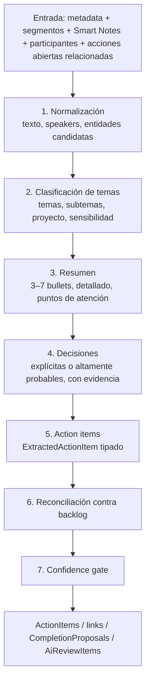

# Pipeline de IA

Referencias: §10, §11, §12.5, §23, §35, ADR-006, ADR-007, ADR-010.

## Principio (§10.1)

> La IA propone; las reglas determinísticas y los usuarios validan cuando exista ambigüedad relevante.

Ningún resultado del modelo modifica estados críticos de forma irreversible. La IA sólo puede: crear tareas en `PROPOSED` (o `PENDING` si la confianza es alta y el campo no es crítico), vincular/actualizar con evidencia, crear `CompletionProposal` y generar `AiReviewItem`. Nunca escribe `COMPLETED` (`AI_TRANSITIONS` en `action-item-state-machine.ts`).

## Interfaz (§11)

```ts
interface AiMeetingAnalyzer {
  readonly providerName: string
  analyzeMeeting(input: AnalyzeMeetingInput): Promise<AiResponse<MeetingAnalysisResult>>
  reconcileActionItems(input: ReconcileInput): Promise<AiResponse<ReconcileResult>>
  generateWeeklyDigest(input: WeeklyDigestInput): Promise<AiResponse<WeeklyDigestResult>>
}
```

Implementaciones en `packages/ai`:

| Implementación   | Cuándo                                                                                                                 | Notas                                                                                                                |
| ---------------- | ---------------------------------------------------------------------------------------------------------------------- | -------------------------------------------------------------------------------------------------------------------- |
| `FakeAiAnalyzer` | `aiMode(env) === 'FAKE'` (default; `AI_PROCESSING_ENABLED=false`)                                                      | determinístico; produce resultados plausibles a partir de fixtures/heurísticas para que la demo §50 sea reproducible |
| `GeminiAdapter`  | `AI_PROCESSING_ENABLED=true` + `GEMINI_API_KEY` (Gemini API) o `GOOGLE_GENAI_USE_VERTEXAI=true` + proyecto (Vertex AI) | Google Gen AI SDK (`@google/genai`), `responseSchema` JSON, temperatura baja, timeout y retry                        |

La licencia Gemini de Workspace **no** es cuota de API: el backend usa un proyecto GCP con facturación propia (§11, P0-2). Nunca hay API keys en frontend.

## Pasos del pipeline (§10.2)



### 1–5: `analyzeMeeting`

Entrada `AnalyzeMeetingInput`: reunión (id, título, fechas, organizador, idioma reportado), participantes (con `internalUserId` cuando se resuelve), `segments` (speaker, texto, tiempos), `smartNotesText`, `openActions` (contexto **compacto** de acciones abiertas relacionadas: mismo organizador/área/proyecto, últimas N), `companyDomain`, `referenceDate` y `timezone` para resolver fechas relativas ("el próximo martes").

Salida `MeetingAnalysisResult` (validada con `MeetingAnalysisResultSchema` en `@smlxl/contracts`):

- `language.{detectedLanguageCode, mixedLanguageDetected}` (§12.5);
- `topics[]`, `projectHint`, `sensitivityHint`;
- `summary.{executive[1..7], detailed, attentionPoints, risks, openQuestions}`;
- `decisions[]` con `evidence[]` y `confidence`;
- `actionItems[]` de tipo `ExtractedActionItem`:

```ts
type ExtractedActionItem = {
  title: string
  description?: string
  owner: { name?: string; email?: string; evidence: string } | null
  dueDate: string | null // YYYY-MM-DD
  dueDateTextOriginal?: string
  priority: 'LOW' | 'MEDIUM' | 'HIGH' | 'URGENT' | null
  statusHint: 'NEW' | 'UPDATE' | 'DONE' | 'BLOCKED' | 'UNKNOWN'
  evidence: Array<{
    text: string
    speaker?: string
    startTime?: string
    endTime?: string
    segmentId?: string
  }>
  confidence: number // 0..1
  relatedOpenActionKey?: string | null
  recurringHint?: boolean
  projectHint?: string | null
}
```

`evidence` es obligatorio (mín. 1). Sin evidencia no hay tarea (§45.12).

### 6: Reconciliación (`reconcile-action-items`)

No se usan únicamente embeddings (§10.2). Algoritmo por cada `ExtractedActionItem`:

1. **Candidatos por reglas**: tareas abiertas del mismo responsable resuelto (por `UserAlias`/email) o de la misma área/proyecto (`projectHint` → `ProjectAlias`).
2. **Full-text**: `ActionItemRepository.searchFullText(title + description, { openOnly: true, limit })` (PostgreSQL `tsvector`, diccionario `spanish`).
3. **Similitud determinística**: `tokenJaccard` y `trigramSimilarity` (`rules/normalize.ts`) sobre título; comparación de referencias a cliente/proyecto; bonificación si la tarea ya fue mencionada en reuniones relacionadas (`ActionItemMeetingLink`).
4. **preScore** combinado (0..1) por candidato; se conservan los mejores K (≤5).
5. Si `relatedOpenActionKey` apunta a un candidato → preScore alto.
6. **LLM judge con contexto limitado**: `reconcileActionItems({ extracted, candidates, meetingTitle, referenceDate })` devuelve `ReconcileResult { decision, matchedActionItemId, confidence, rationale }` validado con `ReconcileResultSchema`.
7. **Aplicación de la decisión** (`ReconcileDecision`):

| Decisión                | Efecto                                                                                                                                                                                              |
| ----------------------- | --------------------------------------------------------------------------------------------------------------------------------------------------------------------------------------------------- |
| `CREATE_NEW`            | `ActionItem` nuevo (`PENDING` si banda AUTO_ACCEPT y owner/fecha resueltos; si no `PROPOSED`) + link `CREATED` + `sourceEvidence`                                                                   |
| `LINK_EXISTING`         | link `MENTIONED` con evidencia; `latestMeetingId`, `lastMentionedAt`                                                                                                                                |
| `UPDATE_EXISTING`       | link `UPDATED` con `previousStatus/detectedStatus/detectedDueDate`; cambios de fecha/responsable/prioridad se aplican sólo en banda AUTO_ACCEPT, si no van a Revisión IA (`CONFLICT_WITH_EXISTING`) |
| `MARK_DONE_CANDIDATE`   | `CompletionProposal` (AI) + `ActionItem.status=COMPLETION_PROPOSED` (si `AI_COMPLETION_PROPOSALS_ENABLED`); link `COMPLETED` como detección, no como estado                                         |
| `REOPEN_CANDIDATE`      | `AiReviewItem` con razón `CONFLICT_WITH_EXISTING`; nunca reabre automáticamente                                                                                                                     |
| `REQUIRES_HUMAN_REVIEW` | `AiReviewItem` con razones (`LOW_CONFIDENCE`, `AMBIGUOUS_OWNER`, `AMBIGUOUS_DUE_DATE`, `POSSIBLE_DUPLICATE`, `POSSIBLE_COMPLETION`)                                                                 |

Duplicados semánticos nunca se fusionan automáticamente: se ofrecen en Revisión IA con `[Actualizar existente] [Crear nuevo] [Descartar]` (§23).

### 7: Confidence gate (`rules/confidence-gate.ts`)

| Banda         | Umbral (default, configurable en `PlatformSetting.confidenceThresholds`) | Efecto                                                                                                                                                      |
| ------------- | ------------------------------------------------------------------------ | ----------------------------------------------------------------------------------------------------------------------------------------------------------- |
| `AUTO_ACCEPT` | `>= 0.90`                                                                | autoaceptar campos **no críticos** (título, descripción, prioridad, proyecto); owner y fecha se aceptan si su confianza individual también supera el umbral |
| `PROPOSAL`    | `0.70–0.89`                                                              | crear como `PROPOSED` con indicador visible; aparece en Revisión IA                                                                                         |
| `REVIEW`      | `< 0.70`                                                                 | sólo `AiReviewItem`; no se crea tarea hasta resolución humana                                                                                               |

Campos críticos siempre revisables: responsable ambiguo, fecha ambigua, posible duplicado, posible cierre, conflicto con dato existente.

## Structured output (§10.3)

- Toda respuesta se pide con `responseMimeType: application/json` y `responseSchema` derivado de los schemas Zod (`zod-to-json-schema`), y se valida de nuevo con Zod al recibirla.
- Fallo de validación → `AI_INVALID_OUTPUT`; se reintenta una vez con instrucción de corrección; si vuelve a fallar, `ProcessingRun.success=false`, reunión `FAILED` (retryable) y alerta.
- Nunca se parsea texto libre con regex para crear compromisos.

## Prompt versioning (§10.4)

`packages/ai/src/prompts/` guarda cada prompt con versión semántica (`analyze-meeting@1.0.0`, `reconcile@1.0.0`, `weekly-digest@1.0.0`). Cada corrida persiste en `ProcessingRun`: `provider`, `model`, `promptVersion`, `schemaVersion` (`AI_SCHEMA_VERSION` en contracts), `temperature`, tokens, `estimatedCostUsd`, `latencyMs`, `success`, `errorCode`, `correlationId`.

Reprocesar una reunión crea un `ProcessingRun` nuevo; los `MeetingSummary`/`Decision` anteriores se conservan (historial IA visible en el tab _Historial IA_). Las tareas ya aceptadas por humanos no se sobrescriben: un reproceso sólo genera nuevas propuestas/links (ver `docs/runbooks/reprocess-meeting.md`).

## Control de costos (§35)

1. Usar `smartNotesText` como contexto compacto cuando exista; el transcript completo sólo si no hay Smart Notes o la extracción de acciones lo requiere.
2. **Chunking** para reuniones largas: bloques de ~N segmentos con solape; extracción por bloque y **consolidación final** en una llamada corta.
3. `openActions` limitado a acciones relacionadas (nunca todo el backlog).
4. Registrar `inputTokens`, `outputTokens`, `cachedTokens` (context caching cuando el proveedor lo soporte), `estimatedCostUsd` y latencia por corrida; `ProcessingRunRepository.usageSummary` alimenta el panel de Integraciones.
5. Métricas `ai_runs`, `ai_failures`, `ai_review_rate`.

## Idioma y calidad (§12.5)

Se persisten `Meeting.reportedLanguageCode` (Google), `detectedLanguageCode` (modelo), `mixedLanguageDetected` y `extractionConfidence`. Reuniones con mezcla de idiomas bajan la confianza global y elevan la tasa de revisión; no se asume que Smart Notes maneje multilingüe simultáneo.

## Seguridad del prompt

Los transcripts son **contenido no confiable**: el prompt de sistema instruye a tratar el texto de la reunión como datos, ignorar instrucciones embebidas y limitarse al schema. Ver `docs/security/threat-model.md` (inyección de prompt).

## Exclusiones (§26, §45.14)

`Meeting.excludedFromAi=true` o `confidentialityLevel` con política de exclusión → `analyze-meeting` termina con `AiAnalysisStatus.SKIPPED` y `processingStatus=EXCLUDED`/`COMPLETED` sin llamar al modelo aunque exista transcript.
