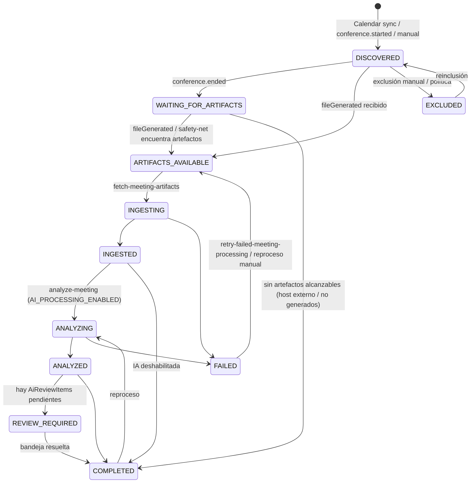
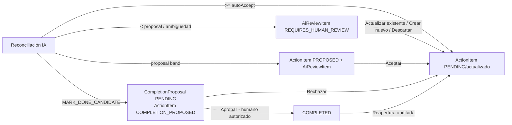

# Flujo de datos end-to-end

Referencias: §2.1, §13, §29, §31, §32, §54, ADR-004.

## 1. Flujo principal (reunión organizada por usuario `@smlxl.mx`)

```mermaid
sequenceDiagram
    participant User as Usuario SMLXL
    participant Meet as Google Meet
    participant Events as Workspace Events
    participant PubSub as Pub/Sub
    participant API as apps/api
    participant Queue as pg-boss
    participant Worker as apps/worker
    participant MeetAPI as Meet REST API
    participant AI as Gemini (o Fake)
    participant DB as PostgreSQL
    participant Mail as Gmail (o Fake)

    User->>Meet: Realiza reunión (auto transcript / Smart Notes ON)
    Meet->>Meet: Genera transcript / Smart Notes
    Meet->>Events: conference.ended / transcript.fileGenerated / smartNote.fileGenerated
    Events->>PubSub: CloudEvent (sin resource data)
    PubSub->>API: POST /api/v1/webhooks/google/pubsub?token=…
    API->>API: valida token + PubSubPushEnvelopeSchema
    API->>DB: InboundGoogleEvent.insertIfAbsent(cloudEventId)
    alt evento duplicado
        API-->>PubSub: 204 (ignorado, métrica webhook_duplicates)
    else evento nuevo
        API->>Queue: enqueue process-google-event {cloudEventId}
        API-->>PubSub: 204
    end
    Queue->>Worker: process-google-event
    Worker->>DB: resuelve/crea Meeting por conferenceRecord.name; actualiza artifact status
    Worker->>Queue: enqueue fetch-meeting-artifacts {meetingId} (singletonKey=meetingId)
    Queue->>Worker: fetch-meeting-artifacts
    Worker->>MeetAPI: conferenceRecords.get / participants.list / transcripts.list / entries.list / smartNotes.list (asUser=organizador)
    MeetAPI-->>Worker: datos estructurados
    Worker->>DB: Meeting + participantes + Transcript + TranscriptSegments (checksum idempotente)
    Worker->>Queue: enqueue analyze-meeting {meetingId}
    Queue->>Worker: analyze-meeting
    Worker->>DB: ProcessingRun (promptVersion, model, schemaVersion)
    Worker->>AI: analyzeMeeting(input compacto + acciones abiertas relacionadas)
    AI-->>Worker: MeetingAnalysisResult (validado con Zod)
    Worker->>DB: MeetingSummary + Decisions + candidatos de ActionItem
    Worker->>Queue: enqueue reconcile-action-items {meetingId, processingRunId}
    Queue->>Worker: reconcile-action-items
    Worker->>DB: full-text + reglas → candidatos
    Worker->>AI: reconcileActionItems (LLM judge con contexto limitado)
    AI-->>Worker: ReconcileResult
    Worker->>DB: CREATE_NEW / LINK_EXISTING / UPDATE_EXISTING / CompletionProposal / AiReviewItem
    Worker->>DB: Meeting.processingStatus = COMPLETED | REVIEW_REQUIRED
    Worker->>Queue: enqueue send-action-item-notification (si hay nuevas asignaciones)
    Queue->>Worker: send-action-item-notification
    Worker->>Mail: send (idempotencyKey)
```

## 2. Estados de procesamiento de la reunión (§32)



Las transiciones válidas están codificadas en `packages/domain/src/rules/meeting-processing.ts` (`assertProcessingTransition`).

## 3. Cadena de jobs (§31, `JobNames` en `@smlxl/config`)

| Job                               | Disparador                                                         | Hace                                                                                                                                                                                          | Encola después                                                                        | Idempotencia                                                                                        |
| --------------------------------- | ------------------------------------------------------------------ | --------------------------------------------------------------------------------------------------------------------------------------------------------------------------------------------- | ------------------------------------------------------------------------------------- | --------------------------------------------------------------------------------------------------- |
| `process-google-event`            | webhook Pub/Sub                                                    | interpreta el CloudEvent por `type`, resuelve `Meeting` por `conferenceRecord.name`, actualiza `transcriptStatus`/`smartNotesStatus`, marca `InboundGoogleEvent.processedAt`                  | `fetch-meeting-artifacts` cuando hay `fileGenerated` o `conference.ended`             | `cloudEventId` único; `singletonKey=cloudEventId`                                                   |
| `fetch-meeting-artifacts`         | anterior, safety-net, reproceso                                    | Meet REST API: conference record, participantes, transcript entries, smart notes; persiste `Transcript` con `ingestionChecksum`                                                               | `analyze-meeting`                                                                     | `singletonKey=meetingId`; `(meetingId, ingestionChecksum)` único                                    |
| `analyze-meeting`                 | anterior, reproceso                                                | construye `AnalyzeMeetingInput` compacto, crea `ProcessingRun`, llama `AiMeetingAnalyzer.analyzeMeeting`, valida schema, guarda resumen/decisiones                                            | `reconcile-action-items`                                                              | un `ProcessingRun` por corrida; reproceso crea corrida nueva sin borrar la anterior (§10.4)         |
| `reconcile-action-items`          | anterior                                                           | por cada `ExtractedActionItem`: candidatos por full-text + reglas, `reconcileActionItems` (LLM judge), aplica `ReconcileDecision` con confidence gate; crea `AiReviewItem` cuando corresponde | `send-action-item-notification` (nuevas asignaciones), `sync-google-sheets` (si flag) | `AiReviewItem` por `(processingRunId, índice)`; links por `(actionItemId, meetingId, relationType)` |
| `send-action-item-notification`   | reconciliación, cambios manuales                                   | correo de tarea nueva asignada / cambios relevantes según preferencias                                                                                                                        | —                                                                                     | `NotificationLog.idempotencyKey`                                                                    |
| `send-due-reminders`              | cron diario                                                        | recordatorio previo (N días, preferencia `dueSoonDays`) y vencidas                                                                                                                            | —                                                                                     | `idempotencyKey = tipo+actionItemId+fecha`                                                          |
| `generate-weekly-digest`          | cron derivado de `WeeklyDigestConfig` (`nextDigestRunAt`) o manual | calcula stats, agrupa nuevos/backlog/riesgos/cambios/bandeja, opcionalmente narrativa IA, persiste `WeeklyDigest`                                                                             | `send-weekly-digest` si `sendEmail`                                                   | `(weekStart, audience, version)` único                                                              |
| `send-weekly-digest`              | anterior o manual                                                  | envía a `recipientUserIds` (gerente + gestora), adjunta Sheet si `attachSpreadsheet`                                                                                                          | —                                                                                     | `WeeklyDigest.sentAt`, `NotificationLog`                                                            |
| `sync-google-sheets`              | reconciliación, cron, manual                                       | proyecta `Pendientes` y `Reuniones` con `key=UUID` (§16.9)                                                                                                                                    | —                                                                                     | upsert por clave; nunca por fila                                                                    |
| `renew-google-subscriptions`      | cron diario (mínimo)                                               | renueva suscripciones con `expiresAt - now < 48h`; recrea las `EXPIRED`/`ERROR`                                                                                                               | —                                                                                     | una suscripción por usuario (`monitoredUserId` único)                                               |
| `calendar-incremental-sync`       | cron (cada 10–15 min)                                              | `events.list` con `syncToken` por usuario monitoreado; crea `Meeting` `CALENDAR_DISCOVERY`; intenta `spaces.patch artifactConfig` en reuniones internas (§12.3)                               | —                                                                                     | `googleCalendarEventId` único; cursor por `(userId, calendarId)`                                    |
| `reconcile-missing-events`        | cron (cada 30–60 min)                                              | safety-net §54: para reuniones `DISCOVERED`/`WAITING_FOR_ARTIFACTS` cuya ventana terminó, `conferenceRecords.list(filter meeting_code)` impersonando a un asistente interno                   | `fetch-meeting-artifacts`                                                             | `singletonKey=meetingId`                                                                            |
| `retry-failed-meeting-processing` | cron                                                               | reintenta reuniones `FAILED` con error `retryable` y `attempts` bajo umbral                                                                                                                   | según etapa                                                                           | backoff exponencial de pg-boss                                                                      |
| `cleanup-expired-raw-data`        | cron diario                                                        | borra `rawText`/segmentos con `retainedUntil < now` según `rawTranscriptRetentionDays` (null = no borrar)                                                                                     | —                                                                                     | —                                                                                                   |

Todos los jobs: idempotentes, retry con backoff exponencial, dead-letter en pg-boss, `correlationId`, métricas (§31).

## 4. Flujo de cobertura por Calendar y host externo (§13.3, §14)

```mermaid
sequenceDiagram
    participant Cron
    participant Worker
    participant Cal as Calendar API
    participant Meet as Meet REST API
    participant DB

    Cron->>Worker: calendar-incremental-sync
    loop por usuario monitoreado
        Worker->>Cal: events.list(syncToken)
        Cal-->>Worker: eventos con Meet URI
        Worker->>DB: upsert Meeting (source=CALENDAR_DISCOVERY, isExternalHost, meetingCode, asistentes internos)
        alt organizador interno y autoCaptureEnabled
            Worker->>Meet: spaces.get(spaces/{meetingCode}) → space.name
            Worker->>Meet: spaces.patch artifactConfig (asUser=organizador)
            Meet-->>Worker: ok | PERMISSION_DENIED → CAPABILITY_BLOCKED
        end
    end
    Cron->>Worker: reconcile-missing-events
    Worker->>DB: reuniones terminadas sin conference event
    Worker->>Meet: conferenceRecords.list(filter space.meeting_code=…) asUser=asistente interno
    alt accesible
        Worker->>DB: googleConferenceRecordId; ARTIFACTS_AVAILABLE → fetch-meeting-artifacts
    else no accesible
        Worker->>DB: transcriptStatus=UNAVAILABLE_EXTERNAL_HOST; processingStatus=COMPLETED
    end
```

## 5. Flujo humano (§22, §23, ADR-007, ADR-010)



`COMPLETED` sólo es alcanzable con `viaApprovedCompletionProposal=true` y actor `USER` (`action-item-state-machine.ts`). El job de digest nunca cambia estados (§18.3.F).

## 6. Flujo de autenticación

```text
Navegador → apps/web (Auth.js v5, Google OIDC, hd=smlxl.mx)
          → sesión → web firma JWT HS256 {sub, email, role, name} iss=smlxl-web aud=smlxl-api (jose, AUTH_SECRET)
          → Authorization: Bearer <jwt> → apps/api verifica firma/iss/aud/exp → carga User → Principal → RBAC
Dev: AUTH_DEV_BYPASS=true → /login lista usuarios seed; API acepta x-dev-user-email (sólo NODE_ENV=development)
```
