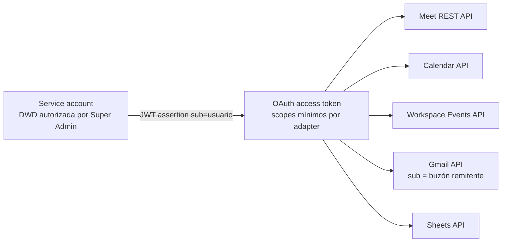

# Integración con Google Workspace — arquitectura

Referencias: §5.2, §12, §13, §14, §15, §27, ADR-002, ADR-004, ADR-005.

## Hechos confirmados que sustentan el diseño (§5.2)

- Google Workspace **Business Standard** incluye transcripción de Meet y "Toma notas por mí".
- Meet REST API v2 expone `spaces`, `conferenceRecords`, `participants`, `participantSessions`, `transcripts`, `transcripts.entries` y `smartNotes` (GA abril 2026 para Smart Notes y sus eventos).
- Un `Space` permite `artifactConfig.transcriptionConfig.autoTranscriptionGeneration` y `artifactConfig.smartNotesConfig.autoSmartNotesGeneration`.
- Workspace Events permite suscribirse a **un usuario** de Meet; recibe eventos de los espacios que ese usuario **posee**.
- Domain-Wide Delegation permite que una service account actúe en nombre de usuarios del dominio.
- Las `transcripts.entries` se conservan ~30 días: hay que ingerir oportunamente.

## Mapa de APIs y adapters

| API Google                           | Puerto del dominio      | Adapter real                                  | Adapter fake                                                | Uso                                                                                           |
| ------------------------------------ | ----------------------- | --------------------------------------------- | ----------------------------------------------------------- | --------------------------------------------------------------------------------------------- |
| Meet REST API v2                     | `MeetingCapturePort`    | `GoogleMeetAdapter`                           | `FakeMeetAdapter` (fixtures `tests/fixtures/google/meet/*`) | spaces, conference records, participantes, transcripts/entries, smart notes, `artifactConfig` |
| Workspace Events API                 | `WorkspaceEventsPort`   | `GoogleWorkspaceEventsAdapter`                | `FakeWorkspaceEventsAdapter`                                | crear/renovar/borrar suscripciones `target=user`                                              |
| Cloud Pub/Sub                        | (webhook en `apps/api`) | validación `PubSubPushEnvelopeSchema` + token | endpoint `POST /integrations/simulate/meeting-ended`        | entrega push de CloudEvents                                                                   |
| Calendar API                         | `CalendarPort`          | `GoogleCalendarAdapter`                       | `FakeCalendarAdapter`                                       | sync incremental con `syncToken` (§14.2)                                                      |
| Admin SDK Directory / Cloud Identity | `DirectoryPort`         | `GoogleDirectoryAdapter`                      | `FakeDirectoryAdapter`                                      | listar usuarios del dominio, resolver `users/{id}` para suscripciones                         |
| Drive / Docs API                     | `DrivePort`             | `GoogleDriveAdapter`                          | `FakeDriveAdapter`                                          | exportar texto de Smart Notes cuando Meet API no baste (§15)                                  |
| Gmail API                            | `MailPort`              | `GmailAdapter`                                | `FakeMailAdapter` (guarda preview)                          | notificaciones y digest (§17)                                                                 |
| Sheets API                           | `SheetsPort`            | `GoogleSheetsAdapter`                         | `FakeSheetsAdapter` (preview en memoria)                    | proyección `Pendientes`/`Reuniones` (§16.9)                                                   |
| Gemini API / Vertex AI               | `AiMeetingAnalyzer`     | `GeminiAdapter` (`packages/ai`)               | `FakeAiAnalyzer`                                            | análisis IA (§10, §11)                                                                        |

Todos los adapters reales: timeout, retry con backoff exponencial para 429/5xx, mapeo a `DomainErrorCode` (`GOOGLE_PERMISSION_DENIED`, `GOOGLE_RATE_LIMIT`, `GOOGLE_NOT_FOUND`, `GOOGLE_TIMEOUT`, `GOOGLE_UNAVAILABLE`, `GOOGLE_CAPABILITY_BLOCKED`), métrica `google_api_errors`.

## Modelo de autenticación (§13.4, §27, ADR-005)



- Una **única service account** dedicada, sin roles amplios en GCP.
- Cada llamada impersona (`asUser`) al usuario dueño del recurso: el organizador para Meet, cada usuario monitoreado para Calendar/Events, el buzón remitente para Gmail. No existe "cuenta omnipotente" (§13.4).
- Los scopes se piden **por grupo de adapter** (`scopesFor('meet')`, etc. en `packages/google-workspace/src/scopes.ts`), no todos a la vez.
- Inventario y estado de cada scope: `docs/security/google-oauth-scopes.md`. El set definitivo se cierra en la Fase 0.
- Login de usuarios: OAuth/OIDC (`openid email profile`) con cliente OAuth separado, restringido al dominio `smlxl.mx`.

## Cobertura de reuniones (§12.4, §13.2, §13.3, §14.3)

| Caso                                                        | Mecanismo                                                                                                                       | Garantía                                                                                               |
| ----------------------------------------------------------- | ------------------------------------------------------------------------------------------------------------------------------- | ------------------------------------------------------------------------------------------------------ |
| Reunión organizada por una de las 10 cuentas                | suscripción Workspace Events `target=users/{id}` por usuario + auto `artifactConfig` vía Calendar sync                          | objetivo automático                                                                                    |
| Reunión con organizador externo donde participa `@smlxl.mx` | Calendar sync detecta el evento → safety-net `conferenceRecords.list` impersonando al asistente interno → ingesta si hay acceso | best effort; si no hay artefacto: `UNAVAILABLE_EXTERNAL_HOST`, visible en UI y en "Calidad de captura" |
| Evento Pub/Sub perdido o suscripción expirada               | `reconcile-missing-events` (§54) + `renew-google-subscriptions`                                                                 | recuperación automática                                                                                |
| Reunión sin Meet o importada                                | `MANUAL_IMPORT` / `LEGACY_IMPORT`                                                                                               | manual                                                                                                 |

`Meeting.source` ∈ `WORKSPACE_EVENT | CALENDAR_DISCOVERY | MANUAL_IMPORT | LEGACY_IMPORT`. `Meeting.isExternalHost` se deriva de `organizerEmail` fuera del dominio.

## Auto-generación de artefactos (§12.3)

```text
Calendar event con Meet creado/actualizado
  -> extraer meetingCode
  -> spaces.get(spaces/{meetingCode})            (asUser = organizador)
  -> persistir space.name canónico
  -> si organizador @smlxl.mx y PlatformSetting.autoCaptureEnabled
       -> spaces.patch artifactConfig { autoTranscriptionGeneration: ON, autoSmartNotesGeneration: ON }
  -> resultado: applied | CAPABILITY_BLOCKED (no rompe la reunión)
```

Nunca se activa grabación de video automática. El resultado se persiste en `transcriptStatus`/`smartNotesStatus` (`PENDING` o `CAPABILITY_BLOCKED`).

## Suscripciones a eventos (§13)

Detalle en `docs/integrations/google-events.md`. Resumen:

- Una suscripción por usuario monitoreado (`User.monitored=true`), `targetResource=//cloudidentity.googleapis.com/users/{id}`, `eventTypes` = 8 tipos de §13.1, `notificationEndpoint.pubsubTopic=GOOGLE_PUBSUB_TOPIC`.
- Payload **sin resource data**: el evento sólo trae `type`, `subject`, `time` y `data.{conferenceRecord|transcript|smartNote}.name`. El detalle se recupera con Meet REST API.
- TTL máximo (hasta 7 días sin resource data); renovación diaria cuando `expiresAt - now < 48h`.
- Idempotencia por `cloudEventId` (`InboundGoogleEvent`).

## Calendar (§14)

- Fuente de **inventario preventivo**, no de compromisos.
- Sync incremental por usuario con `syncToken` (`CalendarSyncCursor`); `410 Gone` → full sync acotado por ventana (`timeMin` = hoy − 7 días, `timeMax` = hoy + 30 días) y nuevo token.
- Campos persistidos: título, organizador, creador, asistentes (internos resueltos a `User`), fechas/timezone, recurrencia (`recurringEventId`), descripción, Meet URI/`meetingCode`, `calendarEventId`, estado.

## Drive / Docs (§15)

Sólo cuando Meet REST API no entregue suficiente: exportar el Google Doc de Smart Notes (`docsDocumentId`) como texto. Preferir `smartNotes` y `transcripts.entries` estructurados. Nunca copiar Drive de forma indiscriminada (§42).

## Retención (§5.2, §15, ADR-009)

- Ingerir `transcripts.entries` en cuanto llegue `transcript.fileGenerated` (ventana ~30 días).
- `Transcript.retainedUntil` se calcula con `PlatformSetting.rawTranscriptRetentionDays` (null = sin borrado hasta que exista política P0-7).
- `cleanup-expired-raw-data` borra texto bruto, no resúmenes ni evidencia vinculada a tareas (`ActionItem.sourceEvidence`).

## Riesgos y mitigaciones (§53)

| Riesgo                                      | Mitigación implementada/diseñada                                                                          |
| ------------------------------------------- | --------------------------------------------------------------------------------------------------------- |
| Política del tenant impide auto Smart Notes | capability check por Space, `CAPABILITY_BLOCKED` visible, transcript como fallback                        |
| DWD/scopes mal configurados                 | spike Fase 0, `GoogleStatusDto` en Integraciones con prueba por scope, códigos `GOOGLE_PERMISSION_DENIED` |
| Eventos perdidos / suscripción expirada     | safety-net §54 + renovación <48h + alertas `OPERATIONAL_ERROR` a administradores                          |
| Rate limits                                 | cola pg-boss, backoff, batching por usuario                                                               |
| Reuniones sensibles                         | `ConfidentialityLevel`, `excludedFromAi`, RBAC                                                            |
