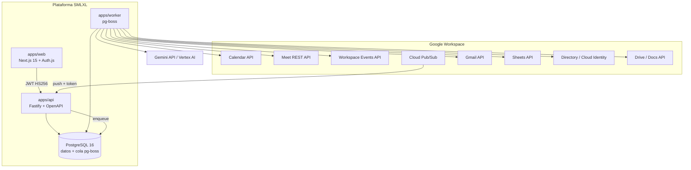

# Arquitectura — visión general

Referencias: §2, §6, §7, §8, §38, ADR-001, ADR-002, ADR-003, ADR-004, ADR-011, ADR-012.

## Decisión principal

La plataforma es **API-first y event-driven** sobre Google Workspace (§2.1). No existe bot participante: Google Meet genera transcripción y Smart Notes, Workspace Events avisa por Pub/Sub, la plataforma recupera los artefactos con Meet REST API, los analiza con IA y reconcilia el backlog. El valor propio está en consolidación, memoria histórica, reconciliación semanal, ownership, vencimientos, trazabilidad y validación humana (§57).

## Componentes



| Componente    | Responsabilidad                                                                                                                          | Nunca hace                                             |
| ------------- | ---------------------------------------------------------------------------------------------------------------------------------------- | ------------------------------------------------------ |
| `apps/web`    | UI en español, sesión Auth.js, Server Components que consumen la API, proxy delgado para Client Components                               | llamar Google/Gemini, contener reglas de negocio       |
| `apps/api`    | endpoints `/api/v1`, validación Zod, RBAC server-side, webhook Pub/Sub idempotente, encolar jobs, OpenAPI/Swagger                        | procesar IA en línea, ejecutar sincronizaciones largas |
| `apps/worker` | jobs de §31: ingesta de eventos, artefactos, IA, reconciliación, notificaciones, digest, Sheets, renovación de suscripciones, safety-net | exponer HTTP público                                   |
| PostgreSQL    | fuente maestra (ADR-003) y transporte de jobs (pg-boss, ADR-001/§6.3)                                                                    | —                                                      |

## Capas lógicas (§8)

```text
Presentation   apps/web · apps/api (rutas) · apps/worker (handlers)
      ↓
Application    packages/application — casos de uso §8.2
      ↓
Domain         packages/domain — entidades, enums, reglas, puertos, eventos, errores
      ↓
Infrastructure packages/database (Prisma) · packages/google-workspace · packages/ai · pg-boss
```

Regla de dependencia: las flechas sólo apuntan hacia abajo; la infraestructura implementa los puertos declarados en el dominio (`packages/domain/src/ports.ts`). `@smlxl/domain` no tiene dependencias de runtime.

### Domain (`packages/domain`)

- `enums.ts`: `ActionItemStatus` (ADR-010), `MeetingProcessingStatus` (§32), `ArtifactStatus`, `ConfidentialityLevel` (§26), `UserRole` (§25), `ReconcileDecision` (§10.2), `GoogleMeetEventType` (§13.1), etc.
- `entities.ts`: `Meeting`, `MeetingParticipant`, `Transcript`, `TranscriptSegment`, `MeetingSummary`, `Decision`, `ActionItem`, `CompletionProposal`, `AiReviewItem`, `ProcessingRun`, `GoogleWorkspaceSubscription`, `InboundGoogleEvent`, `CalendarSyncCursor`, `WeeklyDigestConfig`, `WeeklyDigest`, `AuditLogEntry`, `LegacyImportReference`, `FeatureFlags`.
- `ports.ts`: repositorios (`Repositories`, `UnitOfWork`), `JobQueuePort`, `MeetingCapturePort`, `WorkspaceEventsPort`, `CalendarPort`, `DirectoryPort`, `DrivePort`, `MailPort`, `SheetsPort`, `SettingsRepository`.
- `ai-types.ts`: `AiMeetingAnalyzer` (§11), `AnalyzeMeetingInput/Result`, `ExtractedActionItem` (§10.2 paso 5), `ReconcileInput/Result`, `WeeklyDigestInput/Result`, `AiUsage` (§35).
- `rules/`: máquina de estados de tareas, transiciones de procesamiento de reunión, `isOverdue`/semana ISO/`nextDigestRunAt`, score de atención (§20.5), confidence gate (§10.2 paso 7), normalización y similitud (§16.4), RBAC (§25).
- `errors.ts`: `DomainErrorCode` (§34) y `httpStatusForCode`.
- `events.ts`: eventos de dominio (`MeetingAnalyzed`, `CompletionProposed`, `WeeklyDigestGenerated`…).

### Application (`packages/application`)

Casos de uso de §8.2 (`ProcessMeetingArtifact`, `AnalyzeMeeting`, `ExtractActionItems`, `ReconcileActionItems`, `ApproveActionItem`, `UpdateActionItemStatus`, `GenerateWeeklyDigest`, `SendReminder`, `SyncTasksToGoogleSheets`, `ReprocessMeeting`, `SearchMeetingKnowledge`) más los de soporte (aprobación/rechazo de propuestas de cierre, resolución de Revisión IA, sincronización de suscripciones, sync de calendario, importación legado). Cada caso de uso:

1. valida permisos con `rbac.ts`;
2. aplica reglas del dominio;
3. escribe dentro de `UnitOfWork.run`;
4. audita (`AuditLogRepository`);
5. publica `DomainEvent` que el worker traduce en jobs/notificaciones.

### Infrastructure

| Paquete                     | Adapters                                                                                                                                                                                                                                                                               |
| --------------------------- | -------------------------------------------------------------------------------------------------------------------------------------------------------------------------------------------------------------------------------------------------------------------------------------- |
| `packages/database`         | repositorios Prisma que implementan `Repositories`; `UnitOfWork` sobre `$transaction`; full-text de PostgreSQL para `searchFullText`                                                                                                                                                   |
| `packages/google-workspace` | `GoogleMeetAdapter`, `GoogleWorkspaceEventsAdapter`, `GoogleCalendarAdapter`, `GoogleDirectoryAdapter`, `GoogleDriveAdapter`, `GmailAdapter`, `GoogleSheetsAdapter` y sus equivalentes `Fake*` (§8.3, §45.17). Autenticación por service account con DWD impersonando `asUser` (§13.4) |
| `packages/ai`               | `GeminiAdapter` (Google Gen AI SDK, Gemini API o Vertex AI según `GOOGLE_GENAI_USE_VERTEXAI`) y `FakeAiAnalyzer` determinístico; prompts versionados (§10.4)                                                                                                                           |
| `apps/worker`               | `PgBossJobQueue` implementa `JobQueuePort`                                                                                                                                                                                                                                             |

## Selección de adapters (ADR-011)

```text
googleMode(env) = GOOGLE_INTEGRATION_ENABLED && credenciales ? REAL : FAKE
aiMode(env)     = AI_PROCESSING_ENABLED && (GEMINI_API_KEY | proyecto Vertex) ? GEMINI : FAKE
```

La composición (en `apps/api` y `apps/worker`) construye el grafo de dependencias una sola vez y lo inyecta en los casos de uso. Los flags de BD (`PlatformSetting.featureFlags`) pueden apagar automatizaciones en caliente sin redeploy; el modo REAL/FAKE de adapters se decide al arrancar el proceso.

## Persistencia (§6.4, ADR-003, ADR-012)

- PostgreSQL 16, Prisma, UUID, `timestamptz`, migraciones versionadas en `prisma/migrations/`.
- Auditoría independiente (`audit_logs`), no basada en soft delete.
- Identificadores canónicos de Google (`space.name`, `conferenceRecord.name`, resource names de transcript/smartNote) persistidos tal cual; `meetingCode` nunca es clave histórica (§12.2).
- `InboundGoogleEvent.cloudEventId` UNIQUE como llave de idempotencia (§13.5).
- Texto bruto (`transcripts.rawText`, `transcript_segments`) con `retainedUntil` para la política de retención (ADR-009).

## Seguridad (resumen; detalle en `docs/security/`)

- Login Google OIDC restringido a `GOOGLE_WORKSPACE_DOMAIN`; sesión Auth.js en web; JWT HS256 (`iss=smlxl-web`, `aud=smlxl-api`) firmado con `AUTH_SECRET` hacia la API.
- RBAC en el dominio (`rbac.ts`) aplicado en cada ruta y filtro (`visibleToUserId`).
- Service account con DWD e impersonación por usuario y por scope mínimo (§27); secretos fuera de Git.
- Webhook Pub/Sub protegido por token y por idempotencia.
- Logs con redacción; nunca transcript completo ni tokens (§33).

## Observabilidad (§33)

`@smlxl/observability`: logger pino con `service`, `requestId`, `correlationId`, `userId`, `meetingId`, `jobId`, `googleEventId`, `durationMs`, `errorCode`; registro de métricas (`meetings_discovered`, `ai_runs`, `google_api_errors`, `email_sent`, `digest_generated`…) expuesto en `GET /metrics` en formato texto Prometheus.

## Evolución prevista

- Multi-tenant: la arquitectura lo permite (single-tenant hoy, §4) sin introducirlo prematuramente.
- Cola: `JobQueuePort` permite migrar de pg-boss a BullMQ/Redis si el volumen lo exige (§6.3).
- Búsqueda: fase 1 full-text PostgreSQL; fase 2 pgvector/RAG con citas de reunión (§24).
- Bot de reunión: sólo bajo los criterios de §52, como nuevo adapter `MeetingCaptureProvider`.
